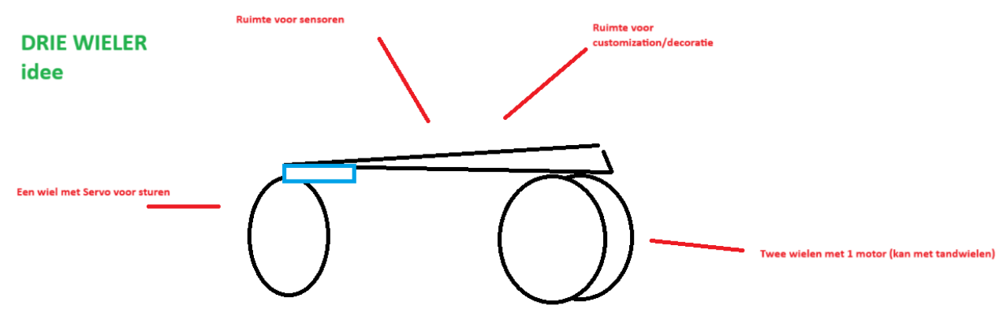
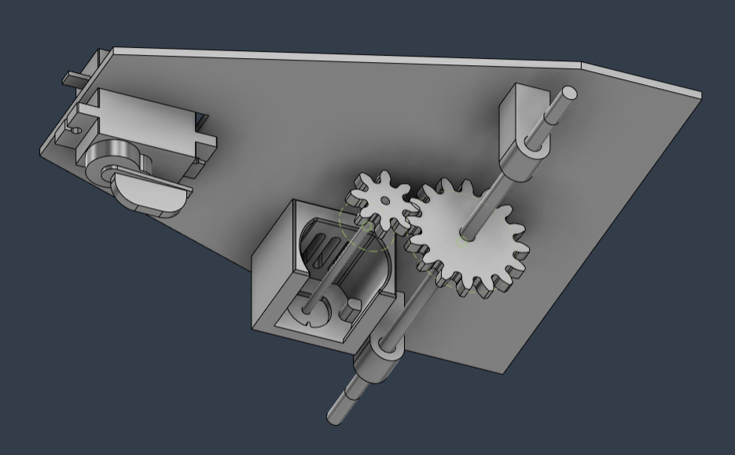

# 3D design
In this file i will explain the process of the 3D design for each Endian

## A:
Little Endian A has been defined as a three wheeled robot with one DC motor in the back to drive two wheels, and a servo in the front to steer the front wheel.
The design first started with a small drawing:

This is the first 3D design, it is done to test the concept. It will be done using 3D printing to test hardware and for ease of use. Later we will design something that uses more sustainable materials like plexiglass or wood. The front wheel has been discarded for now so that we can focus on the back part, instead it has a small sled that is only used to steer.
It must be noted that this is a extreme prototype and may not resembles the final prototype/product.
