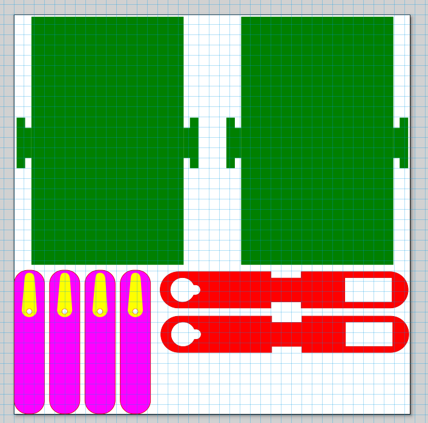

## Robot B Design (robot dog)

This is our current blueprint for lasercutting. We are using acrylic as material with a thickness of 3mm. The thickness of the material is important to keep in mind because the side pieces (shown in red) slot into the green notches.

The green plates are the bottom and top side of the design.
The red parts are the sides of the design. With slots for the servo's on different parts so that the legs can move without the front and back legs colliding.
The purple parts are the legs themselves. These are connected to the servo's and are used to move the robot. The yellow part is what will be engraved onto the legs so that the servo arm can slot into there and be more stable. The legs also have a small hole for a screw to be put in to make sure the servo arm stays in place.