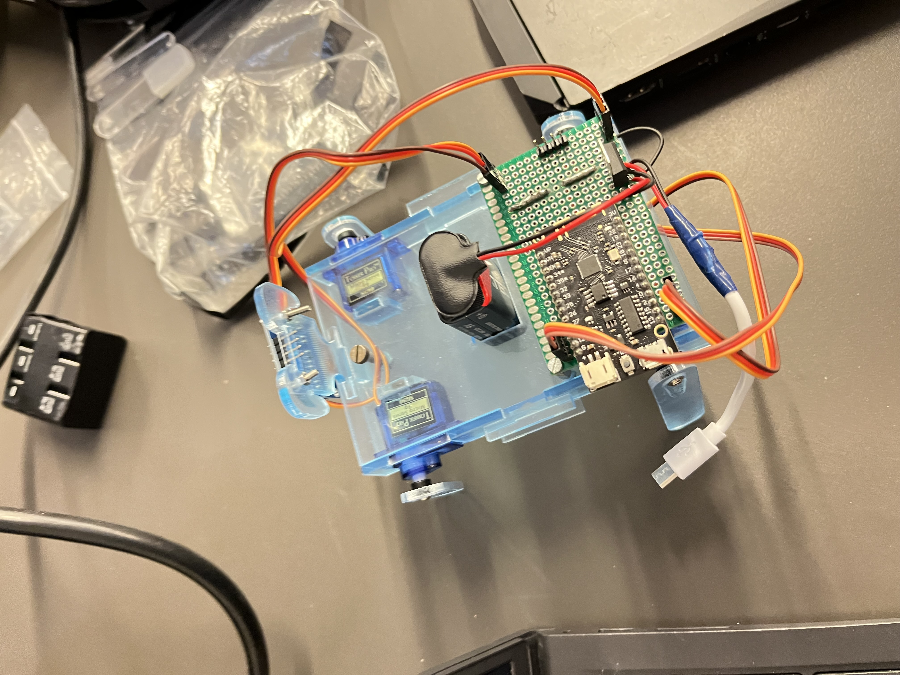

### Learning Story [#119]: Making Database Changes Visible to Team Members

How can I set up and share a database online so my team can use it securely without any issues?

1. Verify Permissions
Ensure that all team members have the correct database permissions.

    1. Log in to the database as an admin.
    2. Check user privileges for the database in phpMyAdmin:  
    ``
    SHOW GRANTS FOR 'username'@'host';
    ``
    3. Ensure they have at least SELECT and INSERT privileges for the new tables.  
    ``
    GRANT SELECT, INSERT ON database_name.* TO 'username'@'host';
    FLUSH PRIVILEGES;
    `` 

2. Ensure Database is Properly Shared  
Check the docker-compose.yml file to confirm:

    - The database service is correctly configured with shared volumes to persist changes.  
    - Example configuration for shared volume:  

    ``
    services:  
    db:  
        image: mariadb  
        environment:  
        MYSQL_DATABASE: my_first_robot  
        volumes:  
        - ./db_data:/var/lib/mysql
    ``

    - The db_data directory ensures all changes, including new tables, are saved and shared.

### Learning Story [#120]: Implementing a MariaDB Database with Docker Compose

How can I create and configure a MariaDB database using Docker Compose to ensure it is easily deployed and accessible for all team members?

1. Setting Up the Docker Compose File: We have configured a Docker Compose file that defines a MariaDB container along with necessary environment variables. This setup allows anyone in the team to easily spin up a consistent MariaDB database environment.

    docker-compose.yml:
    ``
    version: '3.1'

    services:
    db:
        image: mariadb:latest
        container_name: mariadb_container
        environment:
        MYSQL_ROOT_PASSWORD: ${MYSQL_ROOT_PASSWORD}
        MYSQL_DATABASE: ${MYSQL_DATABASE}
        MYSQL_USER: ${MYSQL_USER}
        MYSQL_PASSWORD: ${MYSQL_PASSWORD}
        ports:
        - "3306:3306"
        volumes:
        - mariadb_data:/var/lib/mysql

    volumes:
    mariadb_data:
    ``

    **Explanation:**

    - image: mariadb:latest: This uses the latest official MariaDB image.    
    - container_name: mariadb_container: The container will be named mariadb_container.  
    - environment: Here we define important environment variables like the root password, database name, and user credentials. These credentials are stored in a .env file to keep sensitive information safe.  
    - ports: "3306:3306": This exposes the database on the host machine's port 3306.  
    - volumes: mariadb_data:/var/lib/mysql: This ensures that the database data is persisted across container restarts.

2. Configuring .env file  
    The .env file contains the sensitive environment variables used in the Docker Compose file. It keeps the credentials and database name secure.

    ````
    MYSQL_ROOT_PASSWORD=  
    MYSQL_DATABASE=  
    MYSQL_USER=  
    MYSQL_PASSWORD=  
    ````

3. After setting up the Docker Compose file and .env file, start the MariaDB container:

    ``
    docker-compose up -d
    ``

    This command will pull the MariaDB image and start the database container in the background.

4. Access PhpMyAdmin:  
PhpMyAdmin can be accessed through the web browser at http://localhost:8081. Use the MYSQL_USER and PMA_PASSWORD from the .env file to log in.

### User Story [#129]: Sharing database tables and data via docker-compose.yml
In order to address some of the issues I encountered during the development process, I decided to implement a solution that would ensure persistence of data in MariaDB when using Docker. Initially, I faced challenges with maintaining the database content across container restarts, as well as managing large commits due to changes in the MariaDB data files. Through researching for my learning story, I found an effective solution using Docker volumes and initialization scripts.

1. Data storage Issue:  
Previously, whenever I stopped or deleted the Docker container, I would lose all the data stored in the MariaDB database. To resolve this, I implemented a solution by creating a data folder named mariadb_data. This folder is used to store all the necessary SQL files and data needed by MariaDB. By using a Docker volume, I ensured that data stored in mariadb_data persists even when the container is deleted or rebuilt.

To verify that it works, I tested it by deleting the container, initializing it again, and rebuilding the Docker service. I confirmed that all the rows inserted into the database remained intact, and the tables were still available.

2. Git Commit Issue:  
While trying to commit my changes, I realized that over 200 changes were being tracked by Git, most of which were related to the MariaDB data files. This wasn’t ideal, as it would result in an unnecessary bloated commit history. To resolve this, I needed a way to avoid tracking these large data files in Git while still making sure that the necessary schema and database setup were shared with my teammates.

The solution was to use a .gitignore file to exclude the mariadb_data folder from version control. By doing this, the database data files wouldn’t be included in commits, yet I could still share the database structure and initialization scripts.

3. Creating Initialization Script:  
Since the database tables needed to be created and initialized every time the container starts, I created an init-scripts folder to store SQL files like schema.sql. These files define the structure of the database and the tables, including the robots table, which tracks information such as the robot's ID, UUID, name, and uptime.

I then updated the docker-compose.yml file to automatically run these initialization scripts when the MariaDB container starts. By mapping the init-scripts folder to /docker-entrypoint-initdb.d in the container, Docker will automatically execute the SQL files in this directory upon initialization. This ensures that the database is correctly set up each time the container is started.

The change is located in the volumes part of mariadb in the docker-compose.yml file:
````
mariadb:
    image: mariadb:latest
    container_name: mariadb_container
    restart: always
    environment:
      MYSQL_ROOT_PASSWORD: ${MYSQL_ROOT_PASSWORD}
      MYSQL_DATABASE: ${MYSQL_DATABASE}
      MYSQL_USER: ${MYSQL_USER}
      MYSQL_PASSWORD: ${MYSQL_PASSWORD}
    ports:
      - "3306:3306"
    volumes:
      - ./mariadb_data:/var/lib/mysql
      - ./init-scripts:/docker-entrypoint-initdb.d
````

This setup ensures that the MariaDB container will use the SQL files located in the init-scripts folder to initialize the database when it starts.

4. Testing  
After implementing the changes, I verified that everything was working correctly. I stopped and restarted the containers multiple times to confirm that the data was still there after the restarts. I also tested the database intitaization by ensuring that the robots zable was created properly with the correct structure and that the intitial data was inserted successfully.

### Learning Story [#138]: C++ Coding Conventions Research  
To address challenges in organizing and maintaining clean code for the robot dog’s functionalities, I researched and implemented C++ coding conventions. My primary goal was to create a codebase that adhered to industry standards, ensuring it was modular, readable, and easy to maintain. By referring to the Google C++ Style Guide, I identified and adopted key practices to improve the quality of our code.

This process also helped me with teamwork and allowed me to follow coherent coding connventions when collaborating.

1. Readability and Maintainability  
One of the first issues I noticed was the lack of a consistent style throughout the project. Variable names, function structures, and file organization varied widely because different team members followed their own conventions. This made it difficult for anyone other than the original author to read or debug the code.

After studying the Google C++ Style Guide, I adopted the following conventions:

- File naming: Use CamelCase for filenames (e.g., Face.cpp, Face.h)  
- Variable naming: Use lowerCamelCase for variable names (e.g., isConnected)
- Function Naming: Use lowerCamelCase for function names (e.g., moveForward())  
- Class Naming: Use CamelCase for class names (e.g. RobotDog)

By implementing these naming conventions, I achieved better consistency and improved code readability, which was particularly helpful in a group setting.

2. Using Classes  
A recurring issue was inconsistent use of object-oriented programming. Some group members used classes effectively, encapsulating data and methods, while others preferred standalone functions in header files. This inconsistency caused confusion about how to organize the code.

To address this, we standardized the use of classes:

- Encapsulate functionality into classes: For example, a Leg class would handle all methods related to leg movements (e.g., moveForward(), sit()), while a Head class would handle head-specific actions.
- Separate files for class implementation: Each class has a .cpp file for implementation and a corresponding .h file for declarations.

This structure ensures that the code remains modular and scalable as we add new features to the robot dog.

3. Code redundancy  
Another issue we had to ensure we do not do was code redundancy. Without proper organization, different team members could write the same functionality multiple times in different parts of the codebase. This redundancy not only wastes time but also makes the code harder to maintain.

To combat this, we agreed to:

- Create reusable methods in separate files: For example, instead of rewriting the same walking logic in multiple places, we created a single Walking class with reusable methods.  
- Leverage header files for shared functionality: These header files act as a central source, ensuring consistency and reducing duplicate code.

Coding conventions for developing with C++ are also shared with the team and can be found in the cpp.md file.

**Sources**

- [Google C++ Style Guide](https://google.github.io/styleguide/cppguide.html)

### Learning Story [#140]: Assembling Robot Dog
How can I assemble the robot dog together, in order to make it functioning?  
To answer this answer, I followed the assembly guide of the previous team and moved on on assembling the robot dog. These are the steps that are to be followed:

1. **Attach Risers**  
   Use 3 risers (2.4x16mm) and bolts to secure them to the top plate. These will hold the protoboard.

2. **Attach Sides**  
   Fix the sides to the bottom baseplate. The square hole is for the front servo, and the round hole is for the back servo.

3. **Install Servos**  
   Insert 4 SG90 mini servos into the holes on the side plates. They should fit snugly.

4. **Place Baseplate Connectors**  
   Insert the connectors into the slots on the bottom plate to hold the servos and connect the plates.

5. **Fit the Top Plate**  
   Attach the top plate over the baseplate connectors and sides. Ensure everything aligns tightly.

6. **Secure with Bolts**  
   Use 3.9mm bolts to fasten the top and bottom plates. Tighten gently to avoid cracking the plexiglass.

7. **Attach Legs**  
   Turn the robot dog upside down and use a screwdriver to secure the legs to the servos. Ensure the servos move with the legs.

8. **Add Face Mount**  
   Slot the face mount into the slit at the front of the robot dog.

9. **Mount Protoboard**  
   Attach the protoboard to the risers on the top plate. This will hold the ESP32 and connections.

10. **Place Power Supply**  
    Insert a 9V battery into the slot on the bottom plate. Connect it last to avoid turning the robot on prematurely.

11. **Stick Breadboard**  
    Place the breadboard on the top plate between the battery and face mount. Stick it after trying out its placement.

12. **Install OLED Display**  
    Secure the OLED display to the face mount using bolts and nuts. This will display the robot's emotions.

13. **Connect ESP32 & Wiring**  
    Attach the ESP32 to the protoboard and connect the servos, power supply, and OLED display. Match servo wires (brown to black) and ensure proper placement on the protoboard.  

The robot dog I took up on had already its body assembled, so I continued with the remaining necessary steps.

