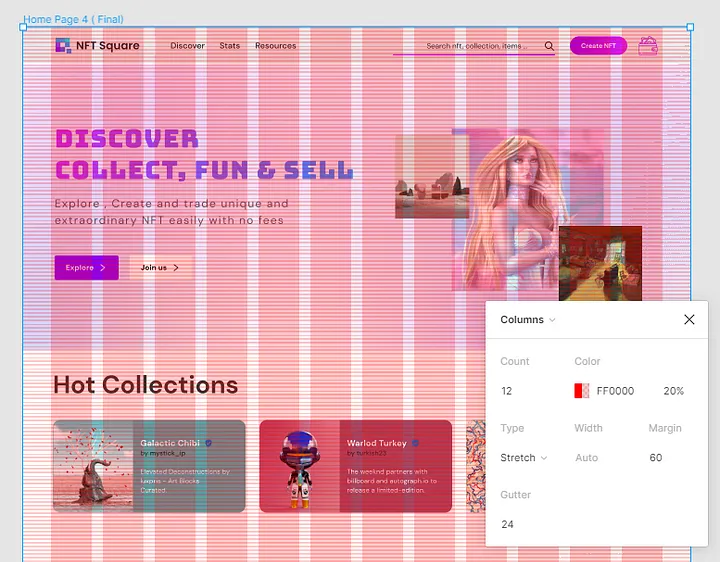

# **Learning Journal |** Tom Jonker

## **Combining GitLab and Agile Workflow**
Since we're using GitLab to achieve an agile workflow, I was curious how we could this interface to increase our workflow. Most important here are the user of Epics, sub-epics and issues in combination with user stories. What do they mean and how can we use their full potential for our project?

### **Epics**
Epics aim to create a strategic view of a product or complex project, breaking it up into smaller manageable chunks. Breaking up a big, multifaceted project into smaller chunks allows for it to be easily digestible and for teams prioritize more important parts of a project, allowing them to allocate resources efficiently.

**Example:** `"Make a user authentication system."` or `"Create a Scratch-like code implementation."` 

### **Features**
Features function as 'sub-epics', dividing the Epic into even smaller chunks. The aim of a Feature is to create a functional chunk, making progress easier to track; key features can be created without the need to complete an entire Epic at once.

**Example:** `"Implement password Recovery"` or `"Develop login functionality"`

### **User Stories**
User Stories ensure features are built with the end-user’s needs in mind, avoiding overengineering or building unnecessary features. They serve as a 'Why' behind the work, promoting understanding between stakeholders and developers, and making it easier to estimateand deliver them witihin a sprint. 

User stories typically follow the format: ***"As a [user type], I want to [action], so that [benefit]."***

**Example:** `"As a user, I want to reset my password so that I can regain access if I forgot it."`

### **Issues (tasks)**
Issues fucntion as the executable task. Issues remove the ambiguity for developers, make progress visible and tangible by marking them as complete, and allowing Product Owners to identify blockers and dependencies early. By assigning a developer to an issue, responsility and ownership can be clarified.

**Example:** `"Desing the password recovery UI."` or `"Create and API endpoint for requesting password resets."`

 
Using these four components allows for an efficient, tangible and manageable Agile environment. Combining and Agile workflow with GitLab can be achieved by using GitLab's Planning functionality, allowing us to create Epics, Features and Issues and visualising them on a trello-like sprint board. Tags can be assigned to each issue, allowing the user to group tasks and assign priorities, visualising the priority of tasks.

---

## **Working with the 8-Point Grid**
Since no screen is the same, displaying the same website, application, dashboard or UI is difficult. The constant increase of pixel densities make the life of designers even more difficult.
Although all screens use different dimensions, popular displays all seem to be divisible by 8, making 8 a great standard for spacing.

The principle of 8pt Grid is that use multiples of 8 (8, 16, 24, 32, 40, 48, 56, etc.) to layout, dimensions, padding, and margin of elements.

### The value of the 8-point Grid

A Point (pt) is a measurement of space that depends on the resolution of a screen. When designing UI, a small artboard/frame is used, which is later upscaled to the required size. Designing on a smaller artboard allows the designer
to scale their assets on other screens easily, while maintaining pixel perfect rendering. Following a grid structure ensures the content of the website is scaled and rendered the same on all devices.

The 8pt grid ensures visual hierarchy to elements and drives consistent scalability, maintaining a 'quality of rythm' and creating a consistent look and feel.
Besides the improved design feel, it is also easier for designers to use in communication. A designer can recognize distances like 4px, 8px, 16px and 24px easily without measuring, as long as the 8pt grid system is used.

<figure markdown="span">
    { align=left }
    <figcaption>Figure 1: 8pt-grid in variables</figcaption>
</figure>

Using Figma as a design tool, variables and grid-layouts can be used to achieve better results. For example, as seen in Figure 1, variables can be made, each holding a larger value following the 8pt grid. This way, margins, paddings and other layout related variables don't have to be set manually, making the designing process more efficient and less prone to errors.

<figure markdown="span">
    { align=left }
    <figcaption>Figure 2: Using auto layout columns</figcaption>
</figure>

When working on websites you must make responsive web pages. The pages not only has to be displayed on a laptop, but also on smaller devices like phones and tablets. When we're talking about design rhythm, horizontal rhythm can be achieved by using a column grid. Again, using Figma as an example, a responsive column grid can be created, helping designers achieve horizontal rhtythm, improving their designs.

source: https://uxplanet.org/everything-you-should-know-about-8-point-grid-system-in-ux-design-b69cb945b18d

---

## Creating a Manageable and easily navigatable knowledge base
To work efficiently and pass over knowledge easily, using a knowledge base is inevitable. Creating the knowledge base's content is a form of art, but creating an easily manageable and navigatable layout is a challenging task, too. Nothing is more frustrating than not finding what you're looking for. Besides, storing similar documents beside each other might increase the odds of opening another similar file out of curiosity and learning something new every day.

The goal of this research is to see if I can improve the layout of the portfolio website, changing it into an easy-to-navigate knowledge base.

### Sections
Storing the content in different sections can help us differentiate between files. Our project can be split up into three sections: Process, Device, and the Project. Inside the process, we store content related to our process, like meetings, conventions, and personal learning journals. The Device section will contain content about the device's inner workings and other related technologies. Finally, we create the Project page, which the user can visit to check out the manual, the setup, and the homepage of the project. Each section can be further split into smaller sections, each becoming more specific, allowing for easy navigation.

### Icons
To further improve clarity, we use icons. Icons help relate some text to certain functionality, but too many icons can be overwhelming and work against us; we have to use icons carefully. 
We could choose to use icons only in the first layer of our navigation bar, limiting the number of icons while still improving the overall navigation usability.

### Table of Contents
The final improvement is relatively simple but can help immensely with the overall look and clarity of the website: the Table of Contents. Currently, the Table of Contents is integrated into the navigation bar, amalgamating the ToC and the content of the navigation bar, making a massive mess of the navigation content. Instead, we could separate the ToC and show this functionality on the webpage. Moving the ToC helps us maintain clarity and improve the overall usefulness of the page and navigation.