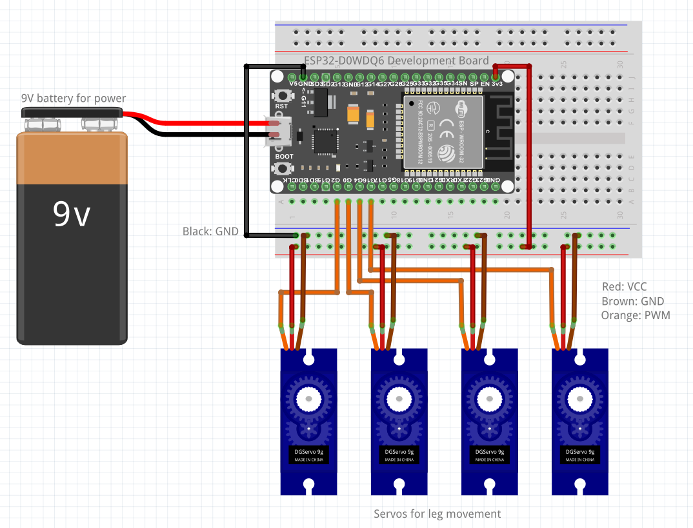

# Technical Documentation
## BOM Robot dog

Partlist for little endian B, A.K.A. Robot Dog

### BOM

|Part #|Manufacturer|Description|Quantity|Price|Subtotal|url|
|---|---|---|---|---|---|---|
| 4563 | Tinytronics | ESP32-D0WDQ6 | 1 | 5,50 | 5,50 | [ESP32-D0WDQ6](https://www.tinytronics.nl/nl/development-boards/microcontroller-boards/met-wi-fi/esp32-d0wdq6-development-board-met-li-ion-li-po-laadcircuit?sort=p.price&order=ASC) |
| 108 | Tinytronics | SG90 Mini servo | 4 | 3,25 | 13,00 | [SG90 Mini servo](https://www.tinytronics.nl/nl/mechanica-en-actuatoren/motoren/servomotoren/sg90-mini-servo) |
| 1257 | Tinytronics | 0,96" OLED display | 1 | 7,00 | 7,00 | [Display](https://www.tinytronics.nl/en/displays/oled/0.96-inch-oled-display-128*64-pixels-blue-i2c) |
| 4720 | Tinytronics | 9v battery | 1 | 1,75 | 1,75 | [Battery](https://www.tinytronics.nl/en/power/batteries/9v/procell-intense-9v-battery) |
| 69 | Tinytronics | 170 point white breadboard | 1 | 1,50 | 1,50 | [Breadboard](https://www.tinytronics.nl/en/tools-and-mounting/prototyping-supplies/breadboards/breadboard-170-points-white) |
| PCB-13| Proto Supplies| PCB universal prototype board| 1 | 0,75 | 0,75 | [Protoboard](https://protosupplies.com/product/pcb-4-x-6-cm-universal-prototype-board/) |
| - | HvA Makerslab | Acrylic sheet , 60x30cm | 24,7 x 16,2 cm | 8,00 | 1,78 | [Acrylic](https://acrylopmaat.nl/en/acrylic/colored/) |
| - | Chanzon | 20mm heat shrink tubing | 3cm | 0,24 | 7,99 | [Heat shrink tubing](https://www.amazon.com/Chanzon-Shrink-Polyolefin-Sleeving-Shrinking/dp/B0B618FHKV/) |
| 493 | TDK InvenSense | MPU-9250 9 axis sensor | 1 | 11,75 | 11,75 | [MPU-9250](https://www.tinytronics.nl/nl/mpu-9250-accelerometer-gyroscope-magnetometer-9dof-module-3.3v-5v) |
| - | - | 3.9x27.8mm bolt | 2 | - | - | - |
| - | - | 1.9x13.3mm screw | 2 | - | - | - |
| - | - | 2.4x16mm riser | 3 | - | - | - |
| - | - | 2.4x7.5mm bolt| 3 | - | - | - |

### Wiring diagram

This is the wiring diagram. It shows how all the components are connected to the ESP32 microcontroller. The diagram was created using Fritzing.

### Base assembly parts

### Purchased items
For later use in declarations and to keep track of the budget, we will keep track of all the items we have purchased for the project.

| Vendor | Ordered item(s) | Cost | Purchased by: |
| --- | --- | --- | --- |
Makerslab HVA | 60x30cm Acrylic | 8,00 | Silvester Rademakers |
Tinytronics | one dc motor 6v, 3 esp32-D0WDQ6 | 20,25 | Timo Lambregts |
makerslab HVA| 60x60cm Acrylic| 16,00| Luc Enderman|
| Makerslab| 60x60cm MDF | 5.50| Luc Enderman|
|Tinytronics| 4x esp32-D0WDQ6 | 22,00| Jayden van Oorschot |
|Makerslab| 60x30cm Acrylic | 8,00 | Luc Enderman |