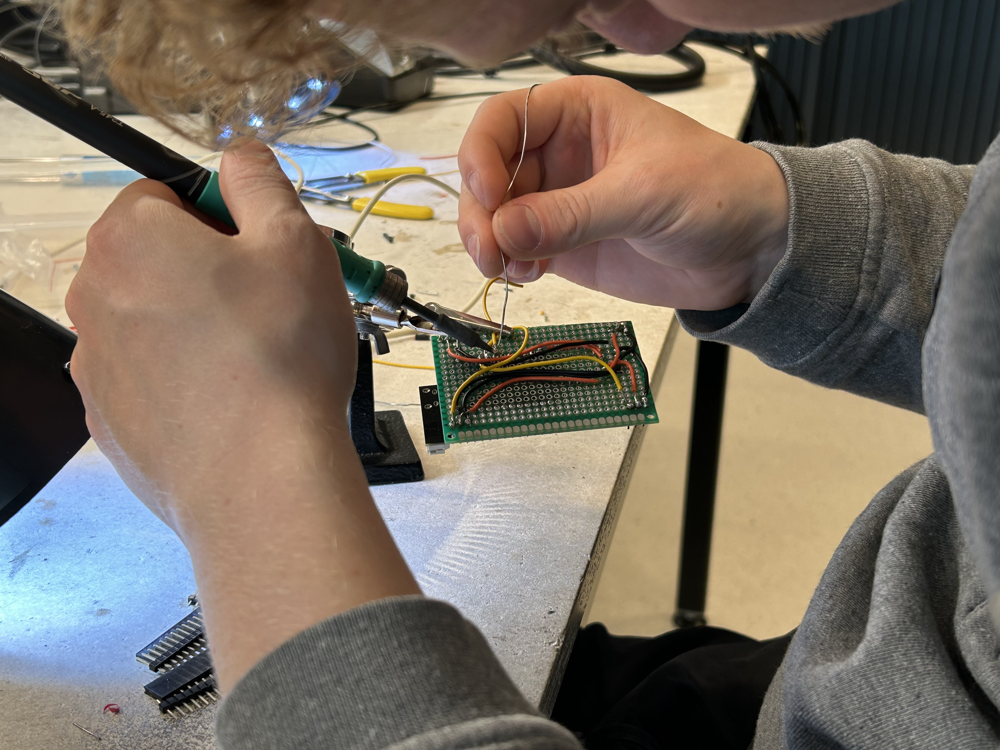
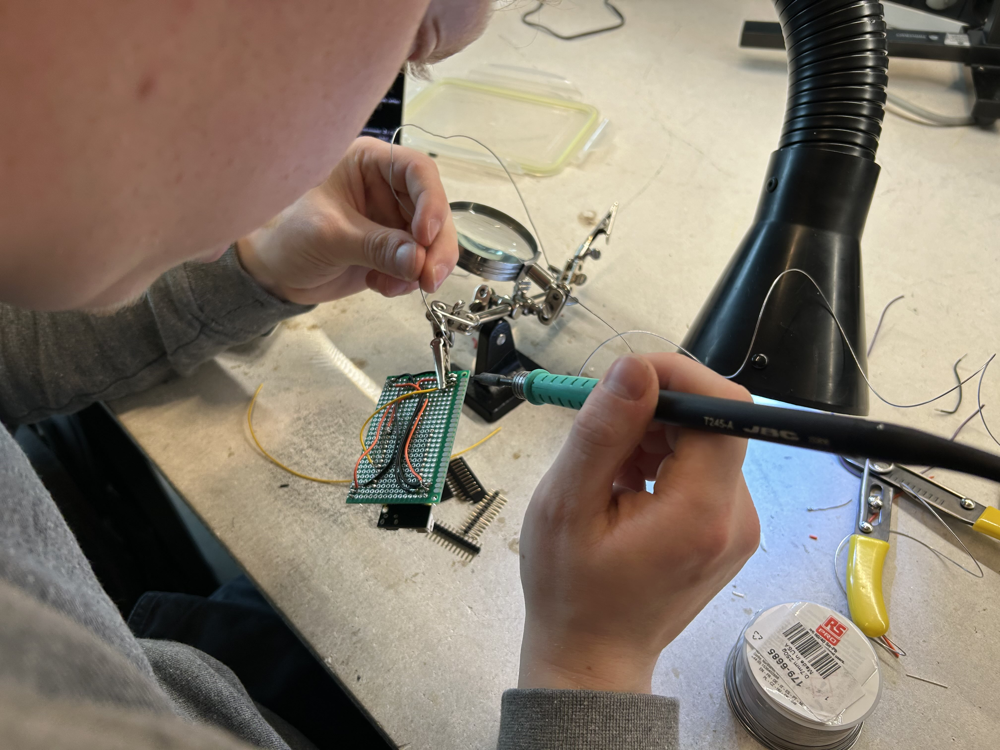
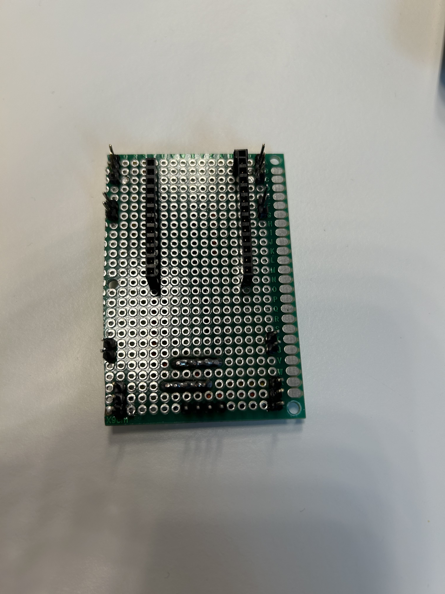
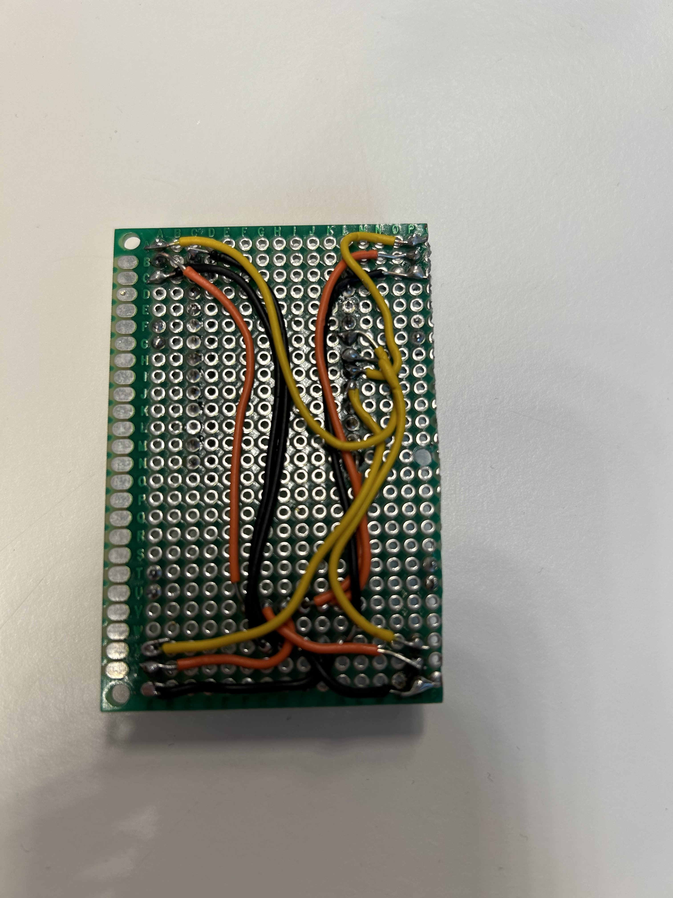

# Learning journal Gjalt

## communication between robot and webserver

**Research Documentation: communication between robot and webserver**

**Research Question:**  
As a student, I want to know if a tunnel is usable for communication between webserver and our robot.

**Approach:**  
We developed a straightforward program in Python to illustrate how this communication setup could function. The program utilized sockets for establishing the connection and JSON for structuring the data exchanged between the web server and the robot.

**Key Components:**

1. **Socket Communication:**  
   Our program created a pathway, like a tunnel, for the web server and the robot to communicate. This pathway, known as a socket, allowed them to exchange messages seamlessly.

2. **Data Serialization with JSON:**  
   To send information from the web server to the robot, we formatted it using JSON. JSON helped organize the data in a way that both the server and the robot could understand easily.

3. **Usage Demonstration:**  
   We demonstrated the functionality of our program by running it. It acted as the server, waiting for the robot to connect. Once connected, it solicited instructions (such as how much to turn) and transmitted them to the robot through the established tunnel.

**Using the Program:**

1. **Setting Up the Server:**  
   - We initiated the program, simulating a server awaiting the robot's connection. It listened for connections on a designated address and port, much like waiting for a call on a specific phone line.

2. **Sending and Receiving Data:**  
   - When the robot connected, the program requested instructions, like how far to turn. These instructions were formatted as JSON and sent to the robot through the tunnel.

3. **Ending the Connection:**  
   - To conclude the communication, we simply typed 'exit', prompting the program to gracefully close the connection.

**Conclusion:**  
Our program demonstrated how communication between a web server and a robot could be established using sockets and JSON. While it served as a basic example, it illustrated the effectiveness of tunnel-based communication. Additionally, it showcased the potential for integration with Arduino code, paving the way for practical implementations in robotics projects.

## protoboard making

The connections on a protoboard with loose is not optimal and causes strange behavior from the robot because some connection can come loose while moving.

so i went to the circulation desk to get a protoboard and started thinking bout how to construct this specifically for our robot. and asked some colleges what i needed here is a quick partslist:

Parts list:
- Protoboard (Can be any size because you can make is smaller with a saw) 
- header risers (for plugging the esp in to the protoboard)
- normal header pins (For plugging the connectors in for the servo's)

When i collected the parts i immediately started wiring the power and ground. after that i decided which pins we where going to use to transfer the data for the servos these are 5, 16, 17, 18.

My college made some pictures of me making the first board. here are the pcitures he made:

when all the soldering was done this was the end result:

