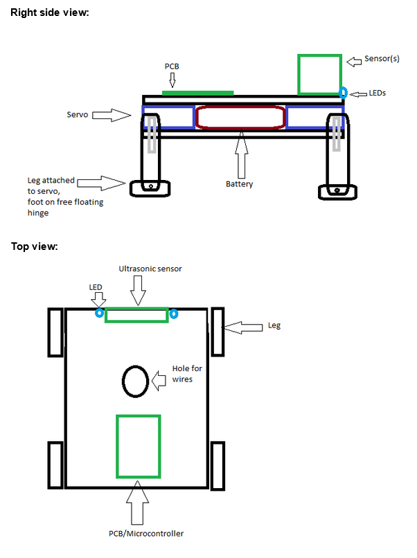
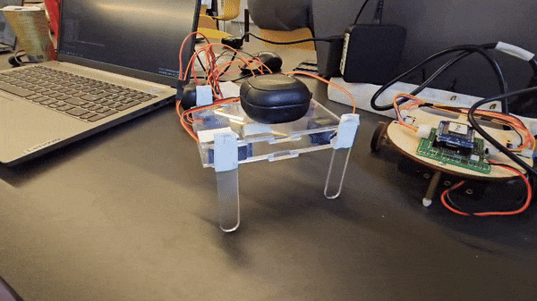

# Learning journal Jayden

## Scrum

I have worked with scrum before, but never at this level. Some of the things I have learned, mostly during sprint 1 and 2:

1. **User stories** are always written from the perspective of the user, always contain a single feature spread across a vertical slice, and have a full definition of done. This way, the user story can be completed in half a day and everything including documentation etc. is done.
2. **Epics** are new to me. They are requirements written down as a big user story, so we can split them up into smaller user stories that are related to the epic. Later on, we also created sub-epics under the epics that then are split up into user stories.
3. Everything is based on the **requirements**. Every part of our project, every decision and design choice is a requirement that we have written down. During the weekly client meetings, we discuss the requirements and make sure we are on the right track.

## Robot dog

### Design

I created the original sketch for our version of the robot dog:

It was based on [this video](https://www.youtube.com/watch?v=KIlq8erelFM&t=735s) that we got from our client. Our current design is a bit different, it doesn't have the feet on hinges and the locations of the sensors and LEDs are not yet decided. Overall, this is still what our robot dog looks like.

### Movement

After our team created a design in Inkscape that we could laser cut and construct, I created a simple walking animation. Again, it was based on the video. It was not very good, but it was just a test:

During sprint 2, after the construction of the robot dog was improved a lot, I created a new walking animation. This time, I paid more attention to the weight distribution and the movement of the legs. It is a lot better than the first one:

**ADD VIDEO**

To achieve this, the robot had to be heavier in the front. To do this I moved the battery forward. This way, when the robot lifts 2 legs on opposite corners, it falls forward. This lifts the hind leg, that can swing forward without moving the robot. Then, the robot can switch front legs and push itself forward with that hind leg that was moved. Repeat this alternating between sides and it walks forward.
