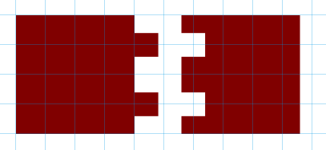
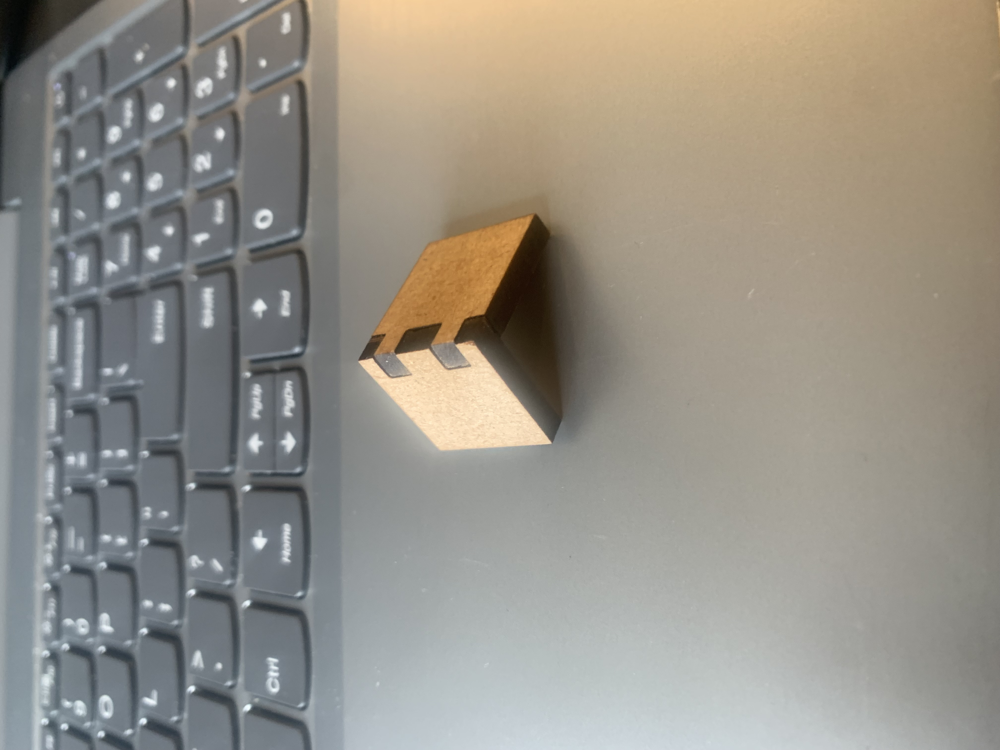

# Learning journal Luc

## Lasercutting

The first thing i researched is how to lasercut MDF or Plexiglas. 

### The software

For this i first had to research which software i needed to use. For this i look at the **knowlagebase** and the website of **makerslab**.
There they talked about **openScad** and **inkscape**. First i looked at openscad, but after a few videos and some information, i determaind that it had way to much of a learning curve and a lot of math. So i looked at the 2nd software, inkscape. 

This was much easier, because you only have to draw what you want to have cut out. So i chose this software to use.

### Test cut

This is my first laser test to see if this connection would be a good fit. Before i cut the design out, i had to keep in mind the **KERF** of the machine, simply put that is the width of the laser. So the cut out part that needs to fit needs to be a little bit bigger then you design. 

This is the final product. You can see here that it has a nice fit which you can easilly assamble and disassamble, which is a requirement for this project. 
