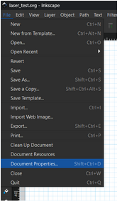
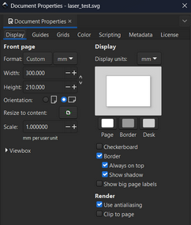
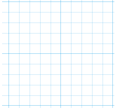
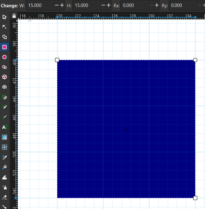
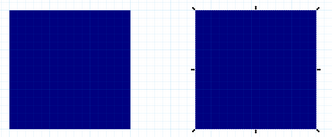
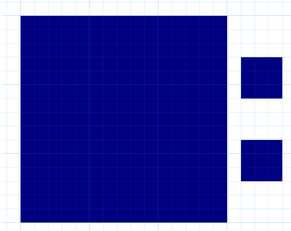
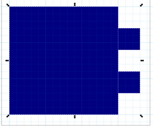
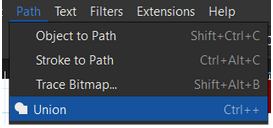
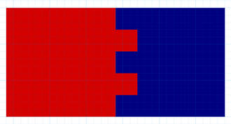
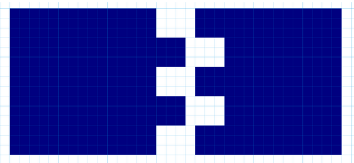

# Basic inkscape
april 24, 2024

Written by: Luc Enderman

Here we are going to talk about what software we are going to use to cut our materials. 

The software we are going to use is [inkscape](https://inkscape.org/release/inkscape-1.3.2/windows/64-bit/msi/?redirected=1). Here you create the 2D design that needs to be cut out by the laser.

## Setup inkscape
There are a few steps you need to take to set up inkscape. First you need to go to the “document properties”.

In document properties you can change how big you want to have your sheet, so you can exactly know how much you can cut out to your sheet.

first change the preferred measurement (I use the metric system with mm), then change the measurements of your sheet to the sheet you have and want to cut. And optionally change the orientation (either portrait or landscape).

Lastly you need to go to the **“grids”** tab.\

Here you can change how big you want you grids to be, you have “small” grid line you can change the measurements you want with the **“Grid units”** i chose here also mm, and then with the **“spacing X and spacing Y”** how big the grids will be. And then with the **“major grid line”** you fill in how many of the small grids you want to have in the big grids.

if you have everything the same as me then you sheet will look like:\

## Make the design
Now you can make the design. It is best if you have some form of design to go off of. The most difficult part of the design is how to connect all the pieces. I have made a simple connection.

First, make a simple squire with the measurements you want. Click on the Rectangle tool in the left bar (or by pressing R). Then make a rectangle, the exact width and height doesn’t matter. You can change the width and height of the rectangle in the top left corner to get the exact measurements (W = width, H = height).

Place the rectangle where you want on you sheet, Then with the rectangle tool click on your rectangle and copy(ctrl+c) and paste(ctrl+v) it next to your existing rectangle. With the “selector tool”(or press S) you can change the position of the selected shape (in this case the rectangle).

Now to make small rectangles for the “fingers” to connect all the pieces.

select the Rectangle tool(press R) and make a 2 3x3mm rectangles.

now for the fun part, you have to connect the fingers, place the fingers to the side of the rectangle where you want the fingers to be.
Click and drag your mouse to connect all the pieces (the big rectangle and the 2 small fingers).

to connect the pieces:
- click “Path” tab in the top of the screen
- then click “union” to connect the pieces

Now the pieces are connected and then you can cut out the holes for the other rectangle.
You need to copy and paste the rectangle with the fingers to cut the holes for the 2nd rectangle(that is the red rectangle).
You lay over the piece with the fingers over the piece where there needs to be holes.

you might need to put the red rectangle with the fingers in the layer above the rectangle that needs to be cut. Right click on the rectangle with the fingers, click on “Layers and Objects” and put the red rectangle above the blue rectangle.

When it looks like this, select everything and go to the “path” tab, and now chose “difference”.
Now you have a rectangle with the fingers and a rectangle with the holes which perfectly fit each other.

KERF: gaat NIET automatisch, moet je even navragen bij makerslab. Kan ook zelf, is een optie aan de linkerzijde van het systeem. Genaamd “Offset” en dan moet je je print groter maken dan dat je wilt printen. Zodat hij snijdt aan de buitenkant van je print

## Video's

[Designing a laser cut tabbed box using inkscape](https://www.youtube.com/watch?v=A1FIl5Eq4PQ&t=175s)