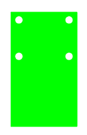
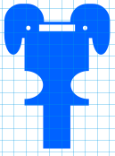

# LCD-mount
June 14-06-2024

Written by: Silvester Rademakers

## Table of contents
1. [Introduction](#Introduction)`
2. [Design](#Design)
3. [Conclusion](#Conclusion)

## Introduction
We will be mounting a LCD screen on the robot dog, this will be used to display emotes and other information to the user. The mount should be sturdy and easy to attach to the robot dog. It should resemble the shape of a dog and be able to hold the LCD screen in place. The mount should also take the wiring of the LCD screen in to account

## Design

### First design
The first design made by Luc 

Luc created this design in quite a quick manner before he had to leave on vacation so it leaves a few things to be desired. The mount is quite simple and doesn't really resemble a dog. The mount also doesn't take the wiring of the LCD screen into account.
The screw holes are seemingly a bit too large but the basic premise of the design is there.

### Second design
The second design made by Silvester 

The second iteration of the design is a bit more refined. The mount now resembles a dog a bit more and the screw holes are a bit smaller. The mount also takes the wiring of the LCD screen into account. The mount is also a bit more sturdy than the first design. It should be able to stick through the top and bottom plate and then rest on the cross part before its "neck". I chose to only include 2 holes for the crews as the screen is quite light and the mount should be able to hold it in place with just 2 screws.	

## Conclusion
The second design is a good starting point for the LCD mount. It should be able to hold the LCD screen in place and take the wiring into account. The design could be improved by making the mount a bit more sturdy and by making the mount resemble a dog a bit more. The mount should also be able to be attached to the robot dog with ease. 
