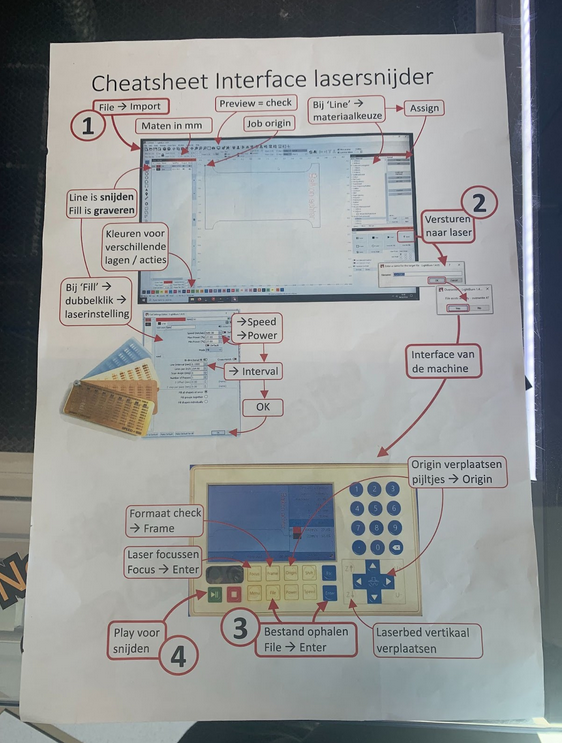
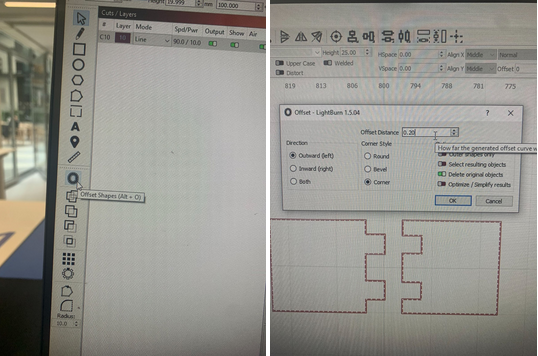

# Lasercutting
April 24, 2024

Written by: Luc Enderman

Here we are going to talk about how to use the laser cutters (we have on campus). 

Here is a cheat sheet on how to operate the laser printer:

1. import file from usb stick.
2. change material on the right side of the screen. Press assign
3. extra options of Speed, power etc.
4. change KERF
5. send to printer
6. press file to get your file (there should always be one file on display)
7. press enter to select the file
8. change the start of the laser with the arrows
9. press origin, to set the start of the laser
10. press frame to check if position of laser is correct (repeat 8-10, until placement is perfect)
11. for first time new material, press focus to automatically change height of laser.
12. press green play button to start the cut.

## KERF
an important note, If you want to cut material that needs to be fit together perfectly you need to remember the KERF. Simply put this is the thickness of the laser, so witch cuts like these you need to cut it a little bit bigger then you have on paper.

for this machine you need to put the KERF on 0.2mm

So you select everything and then click on the offset button (or press Alt+O), fill in the options on the screen, if you want a tighter fit you need to increase the offset distance.

