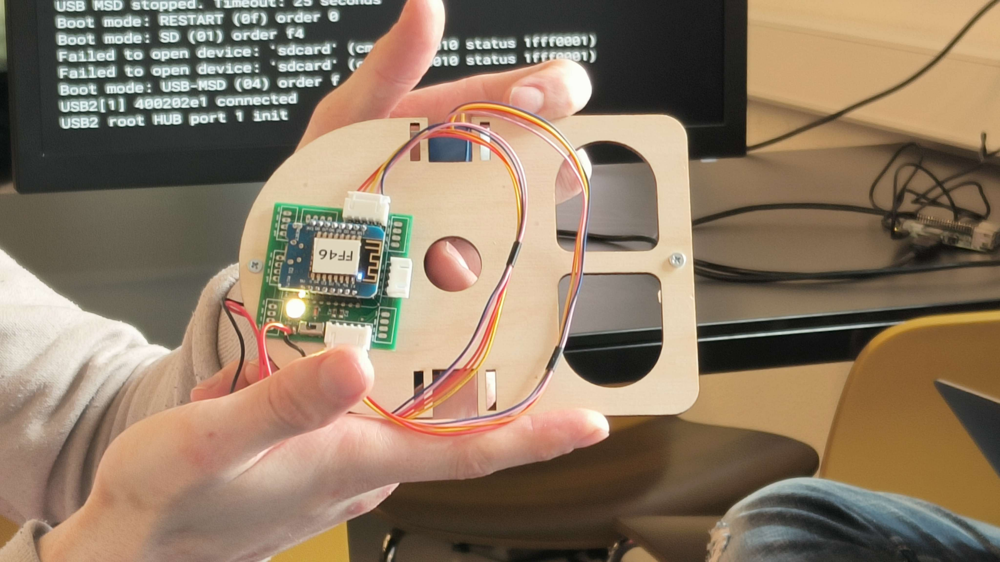
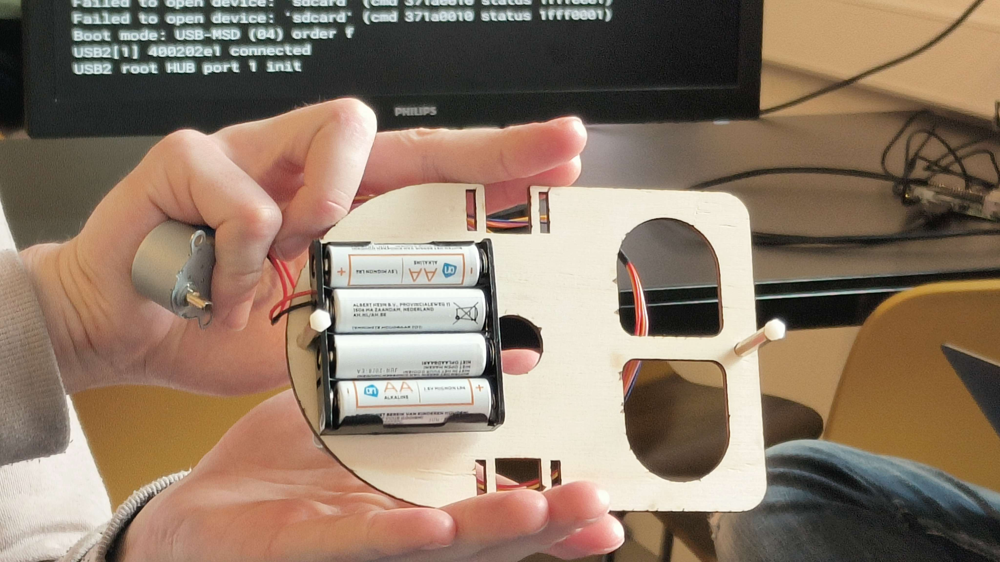
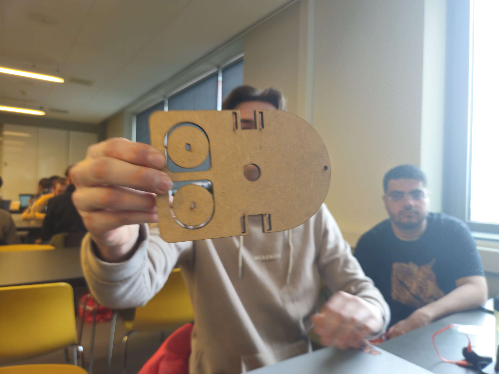
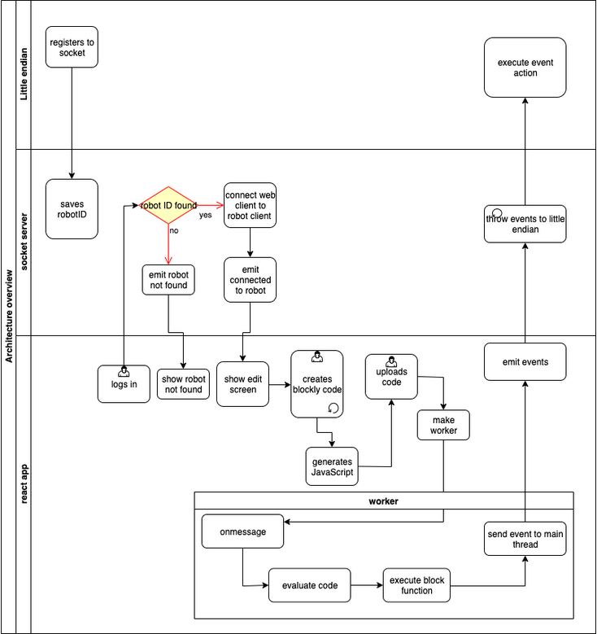

# Little endian 1.0 research
April 26, 2024

Written by: Silvester Rademakers

[Original Little endian 1.0 Project](https://gitlab.fdmci.hva.nl/pijlb/little-endian/-/tree/main?ref_type=heads)

[Little endian 1.0 Project 2021](https://gitlab.fdmci.hva.nl/IoT/archive/sep-jan-2020-2021/group-projects/little-endian)\
[Little endian 1.0 Firmware 2021](https://gitlab.fdmci.hva.nl/IoT/archive/sep-jan-2020-2021/group-projects/little-endian/firmware-little-endian/-/blob/develop/little-endian_d1mini/src/Little-Endian.ino?ref_type=heads)

## Table of contents
1. [Little endian 1.0 Hard/Software](#Little-endian-1.0-Hard/Software)
2. [Little endian 1.0 Physical](#Little-endian-1.0-Physical)
3. [Little endian 1.0 Architecture](#Architecture)
4. [Potential improvements](#Potential-improvements)

## Little endian 1.0 Hard/Software
### Hardware:
The original little endian project was made with the Wemos D1 Mini\
2 stepper motors are used to drive and steer the little endian.
It has 2 acorns on which it balances the front and back side whilst the sides have the wheels.
The Wemos is mounted on a custom printboard which has slots for the stepper motors, has a status led and is connected to the battery holder.

### Software:
The original little endian project makes use of a socket server between the Webapp and the Little endian

Bas Pijls made an edit to the accelstepper library so that its possible to extend and use shift registers.

## Little endian 1.0 Physical

The stepper motors and wheels are currently not connected to the base.

The wooden base after laser cutting without pushing out the wheels:

## Architecture

## Potential improvements

These are some improvements that could potentially be made at a first glance:

- 3D printed hold for stepper motors
The stepper motors in the current design are held by tie rips. These need to be broken with scissors whenever you want to disassemble the little endian, this could be improved by making the parts that hold the motor easier to reproduce and reuse. By making a thinly 3d printed part it should fit 
- 2 separate 2AA battery holders
The current battery holder is quite large and takes up a lot of space. 4 AA batteries are needed but by splitting them up in 2 by 2 the space on the little endian could be utilized better.
- Base in plexiglas instead of multiplex
Plexiglas is more durable and more environmentally friendly.
- Increase wheel size and lessen friction with other parts.
The current wheels have some trouble turning, this is partly to blame to the friction the front and back chestnut have with the table. This could maybe be fixed by increasing the size of the wheels or changing the design a bit so it has less friction with the chestnuts.

There could be many more potential improvements. These could be found later in the process of assembling the little endian 1.0
