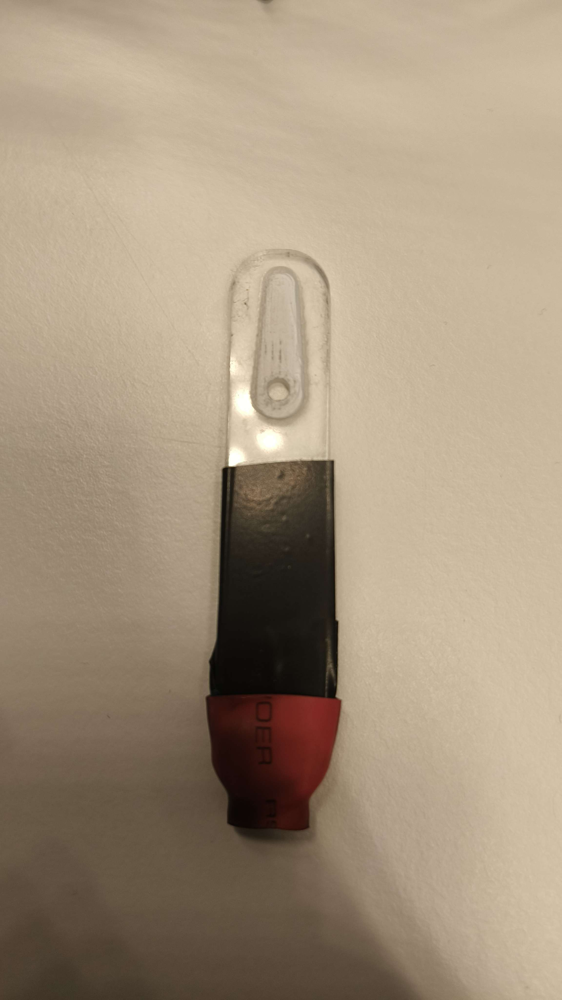
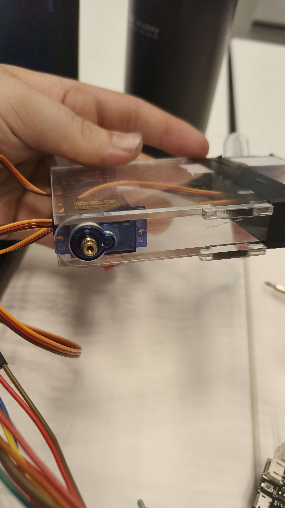

# Robot dog improvements research
May 24, 2024

Written by: Silvester Rademakers

## Table of contents
1. [ Introduction ](#Introduction)
2. [ Issues with the first prototype ](#Issues-with-the-first-prototype)
3. [ Potential Improvements ](#Potential-Improvements)
4. [ Conclusion ](#Conclusion)

## Introduction
Out of the prototypes we've created for the first sprint we've chosen to continue with the robot dog for the remainder of the project.
From observing our first prototype and discussing amongst the team we've come up with a few improvements which could be made to the next iteration of the robot dog

## Issues with the first prototype
The legs in our first prototype did not come out quite how we wanted them to. We had made an inlay in the legs for the servo's horn to fit in, but due to the length of the screws the horns made it hadder for the legs to be securely attached. 

The legs also did not grip surfaces to well and the robot dog would slip quite a lot whilst trying to walk. We tried to remedy this in the first prototype by adding rubber to the end of the legs. This helped a bit but the robot dog would still slip quite a lot.

Another problem we faced was that the servo's could be pushed back into the frame a bit too easily when force is applied (e.g. when attaching the legs).

The wiring also gets cluttered quite quickly.

## Potential Improvements
The legs can be improved by making the inlay in the leg just for the servo without use of a horn. This way the leg can be attached to the servo without the horn so there's more room for the screw. This will make the legs more secure and less likely to fall off.

The legs can also be improved by adding rubber to the bottom of the legs to increase grip. The shape could also be edited a bit to increase the surface area of the legs.

The servo's can be improved by adding a small piece of plastic to the frame which can be placed behind the servo's. This way the servo can't be pushed back into the frame.

The wiring could be improved by adding a small hole for the wires to be routed through on the top plate. This way the wires have to bridge a shorter distance limiting clutter.

## Conclusion
I will be improving our design with the afformentioned improvements and will be testing them with the next prototype.