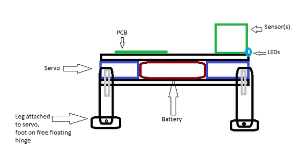
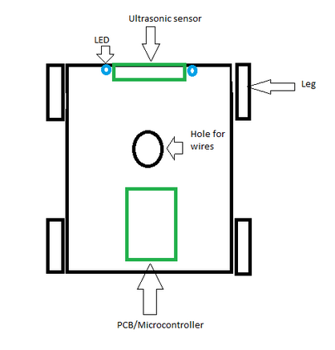

# Robot dog research
April 22, 2024

Written by: Jayden van Oorschot

## Table of contents
1. [Example design](#Example)
2. [Our design](#Our-design)

## Example design
### [video example](https://www.youtube.com/watch?v=KIlq8erelFM&t=735s)

### robot from plexiglas:
  body: 4 pcs\
  legs: 8pcs, 2 each\
  head: 2 pcs

  14 pcs total, ~15cm^2 plexiglas

### Servo's:
  9x SG90 servo

### PCB:
  Custom PCB
  Small chip
  Switch
  IR sensor (for remote control)
  Micro-USB connector
  Resistors

### Head:
  Small custom PCB
  Resistors
  2x LED
  Plastic cover

### Rest:
  Li-ion battery
  Wires
  Small IR remote

### Requirements:
Has WOW-factor: 		yes\
Has moving parts: 		yes\
Is easy to assemble: 		Almost yes (except soldering to PCB)\
Is under €20: 			No\
Everything well documented: 	No, design files and process missing (only final showcase)\
Fits in smart city theme:	No (no sensors)

## Our design
4 legs, no powered joints so only 4 servos. (walks like [this](https://youtu.be/KIlq8erelFM?si=LA_s2EodDFYTu9LX&t=873))\
PCB or breadboard with plugs, no soldering\
Similar plexiglas construction with parts that fit together like Lego\
Has sensors to fit smart city theme, ultrasonic sensor for now\
Has LEDs because they’re cool

#### Right side view:

#### Top view:

### Requirements:
Has WOW-factor: 		too vague\
Has moving parts: 		yes\
Is easy to (dis)assemble: 	yes\
Is under €20: 			yes\
Everything well documented: 	yes? (still working on that)\
Fits in smart city sub-theme:	yes

### Parts list:
Plexiglas\
microcontroller/PCB\
4x SG90 servo\
Ultrasonic sensor\
LEDs\
Wires

### How eco friendly:
- Plexiglas: 100% recyclable, versatile, very durable, costs less energy to produce than most materials and lightweight so transport costs less.
- PCB: Depends on manufacturer, I can’t find info on PCBway but Eurocircuits is based in Germany and Belgium where rules are strict
- Microcontroller/MCU: has to be RoHS compliant
- SG90 servo: If it’s made by a specific brand, like TowerPro,it can be RoHS compliant. The one we already have has no brand name or logo on it, and I don’t know if it’s RoHS compliant.
- Sensors and LEDs must be RoHS compliant
