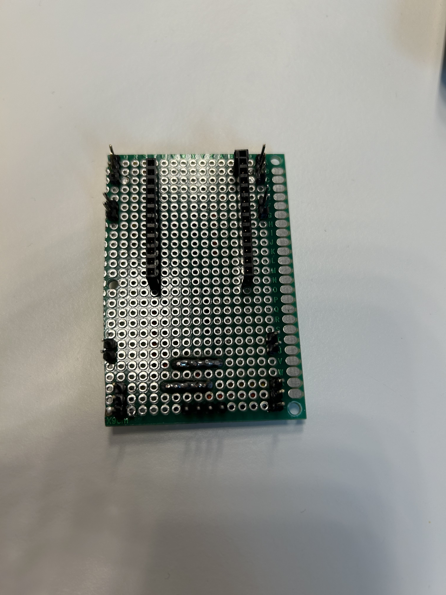
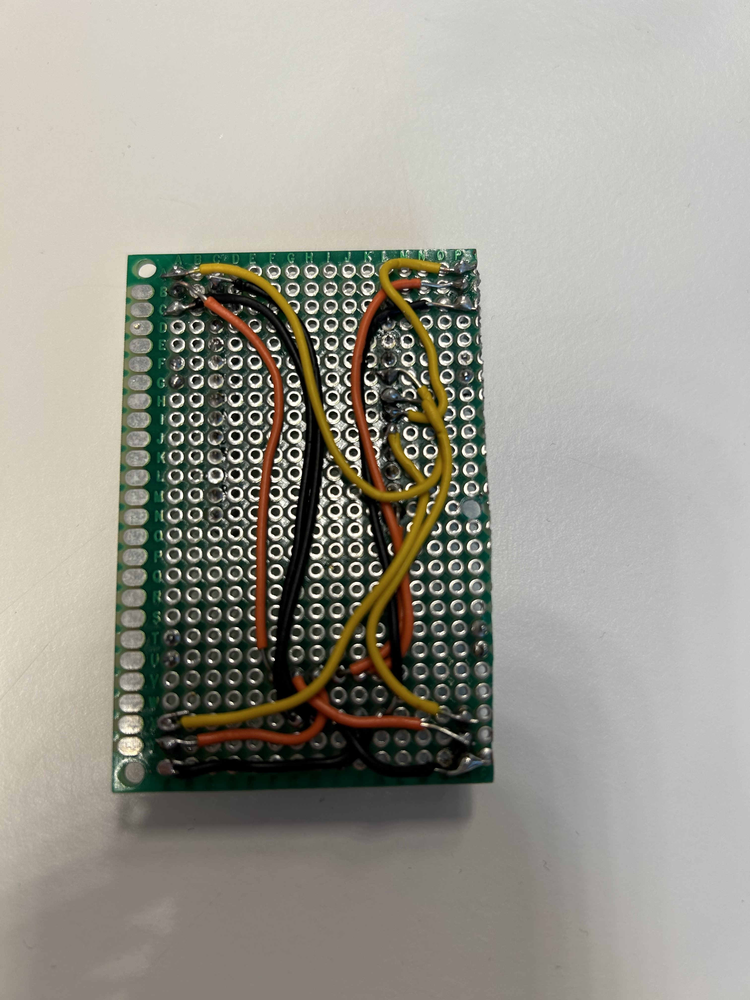

# Protoboard research

Because a breadboard is not good enough and a PCB is still very complicated, we decided to use a protoboard for now. A protoboard is a board with holes that you can solder things into. First, we soldered pins and headers on the board so we can later attach the ESP32 and the servos. Then, we soldered wires to the bottom. We attached red wires from the power pins on the servos to a line on the board, so they are all connected. Then, that line was connected to the 3.3V pin on the ESP32. We did the same with the ground pins, but connected them to the GND pin on the ESP32. We also connected the signal pins on the servos to the GPIO pins on the ESP32.

This is what the top of our protoboard looks like:

The rows of holes are for the ESP32. The sets of 3 pins on each corner are for connecting the servos. The sets of 2 pins are currently unused.

And this is what the bottom looks like:

All the power wires are connected together and to the 3.3V pin on the ESP32. All the ground wires are connected together and to the GND pin on the ESP32. The signal wires are connected to the correct GPIO pins on the ESP32.
