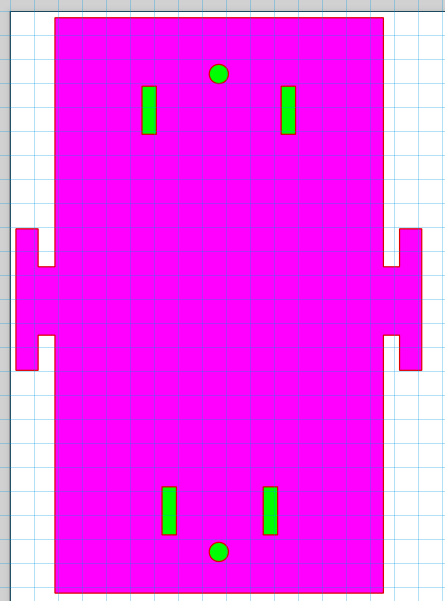

# Robot dog screws research
April 30, 2024

Written by: Silvester Rademakers

## Introduction
To solidify the base of the robot dog and stop it from being needed to be taped together, we need to find a way to secure the parts together. We taught about changing some of the design but complications in the laser cutting process made us decide to keep the design the same and find a way to secure the parts together. Adding a few screws seems like the best option.

## Placement
We decided to add screws to the robot dog at the ends between the servo's. These screws will be fastend with nuts on the other side of the plexiglas. This way the screws will keep the bottom, top and side plates together. Improving the overal stability of the robot dog and making it more durable.

The screw placement here is shown in green between the vertical holes for the servo blockers. The placement of the screws is identical on the top and bottom plate.