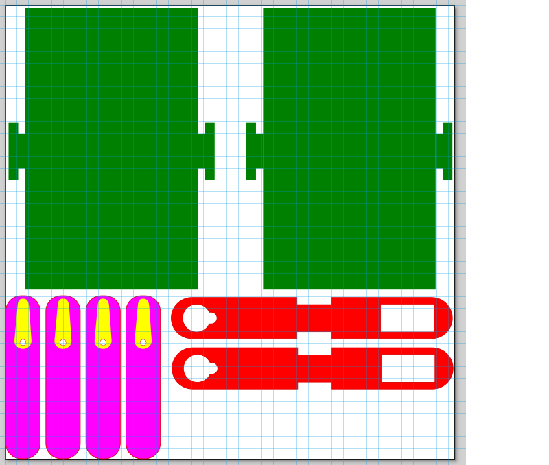
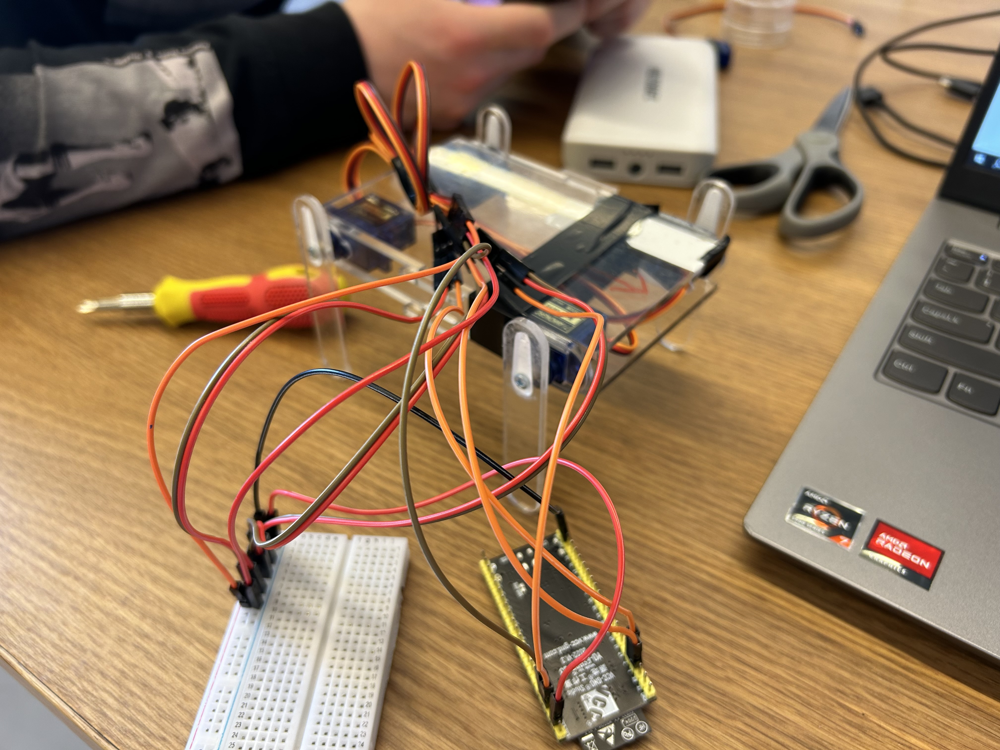
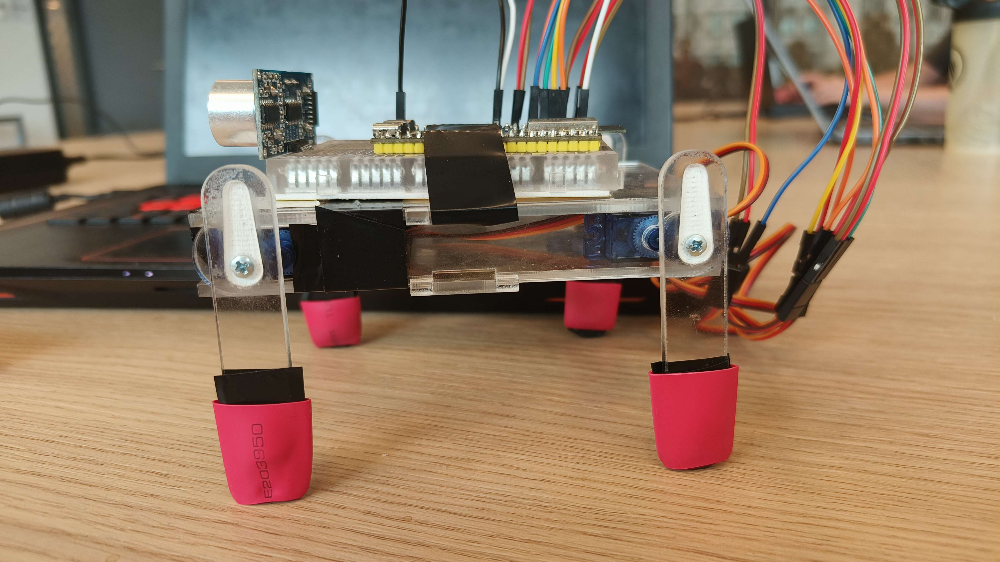
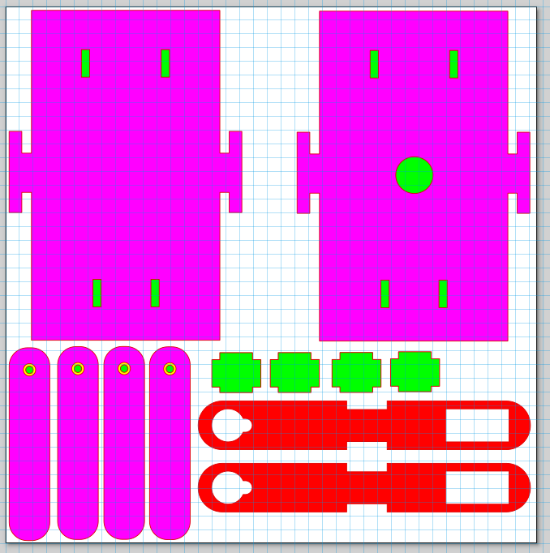
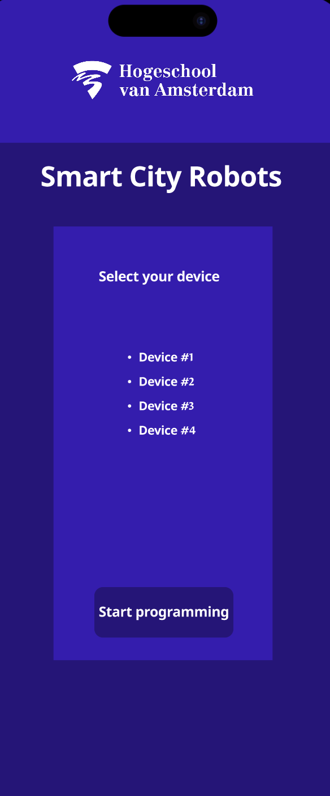
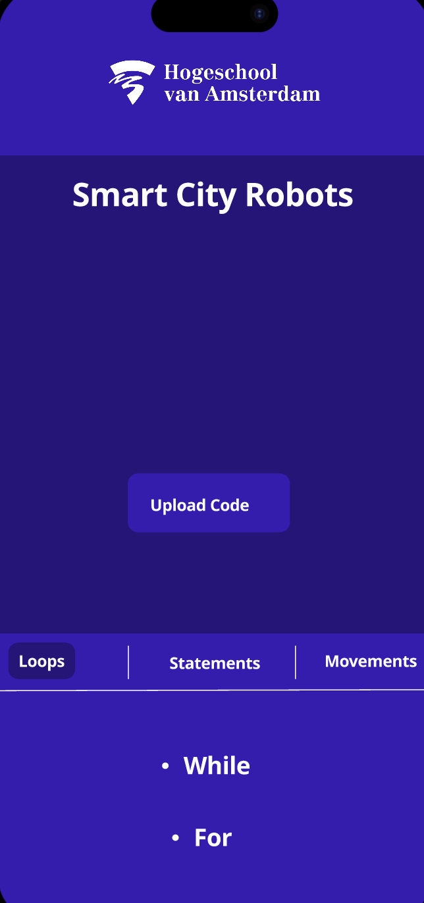
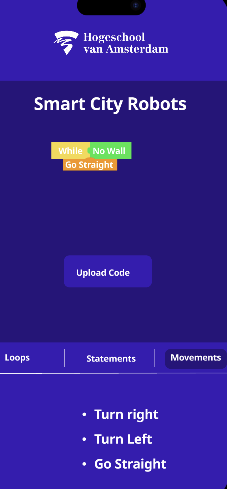

# Concept & Design

## Robot dog Production

### Initial design
##### Robot-dog 2.0
Our original vision for the robot dog came from a [video](https://www.youtube.com/watch?v=KIlq8erelFM&t=735s) shown to us by our client. The robot dog in the video was made out of plexiglas and had 4 legs with 2 joints each. The robot dog was controlled by 9 SG90 servos and had a custom PCB with a small chip, a switch, an IR sensor, a micro-USB connector, and some resistors. The head of the robot dog had a small custom PCB with 2 LEDs and a plastic cover. The robot dog was powered by a Li-ion battery and had a small IR remote. The robot dog had a WOW-factor, moving parts, was easy to assemble, but was not under €20, not well documented, and did not fit the smart city theme. We decided to make our own version of the robot dog that would be more affordable, better documented, and fit the smart city theme. We decided to make a robot dog with 4 legs and 4 servos that would walk like the robot dog in the video. We would use a PCB or breadboard with plugs instead of soldering, a similar plexiglas construction with parts that fit together like Lego, sensors to fit the smart city theme.

This is the design we came up with for the robot dog:

It has a top and bottom plate (shown in green), The side pieces (shown in red) which can slot its notch into the side bits of the top and bottom plate. The holes in the legs are for the servo's to fit in. you'll see that the front and back hole is slightly different. This allows the servo's to be placed in two different ways, This makes it so the legs dont 
And finally the legs (shown in purple) which also had an inlay (shown in yellow) for the horns of the servo's to fit in and a small hole for a screw to connect it to the servo directly.

### Issues with the first prototype

The first design we made for the robot dog was a simple design with 4 legs and 4 servos. The legs were attached to the servos with a horn and a screw. The legs were made out of plexiglas and had rubber feet for grip. The servos were attached to a frame with screws and the wiring was routed through the frame. The design was simple and easy to assemble but had some issues. The legs were not very secure and the robot dog would slip a lot. The servos could be pushed back into the frame too easily and the wiring would get cluttered quickly. We decided to make some improvements to the design for the next iteration of the robot dog.

### Second iteration

We made some improvements to the design for the second iteration of the robot dog. We made the inlay in the legs just for the servo without the horn. This way the leg could be attached to the servo without the horn so there was more room for the screw. This made the legs more secure and less likely to fall off. We added a small piece of plastic to the frame which could be placed behind the servo's (green cross pieces are slotted into the green slits in the bottom and top plate). This way the servo could not be pushed back into the frame. We also added a small hole for the wires to be routed through on the top plate. This way the wires had to bridge a shorter distance limiting clutter.

## Web 
### Figma Design

 
Info 
<a href="https://www.figma.com/file/QwEjuxT9gG5FV2NpbiBzCe/Little-Endian-Web?type=design&node-id=2311%3A2&mode=design&t=2ituEHdazxHDJet1-1">Click here</a>,
to see the Figma design.

For designing the webpage, Figma was chosen. Figma is a design tool used for creating user interfaces, prototypes, and collaborative design projects.

In designing the webpage, consideration was given to the colors used on the current website of the Amsterdam University of Applied Sciences (HvA). As a result, two different shades of blue representing the HvA colors were chosen, along with the color white for text to ensure readability.

On the first page, the user should be able to easily connect with their device. To achieve this, a list displaying all available devices was presented. The user can select their device from this list and then connect by pressing the "Start Programming" button. A rectangular button with rounded corners was chosen to clearly indicate its function.

On the second page, users can work with codeblocks. Inspiration for designing codeblocks was drawn from similar websites such as MIT App Inventor and Scratch. This led to the decision to display a menu at the bottom of the screen, allowing navigation between Loops, Statements, and Movements, each with its own set of options. This enables users to create and upload their own codeblocks.

This is how the initial design turned out: 

