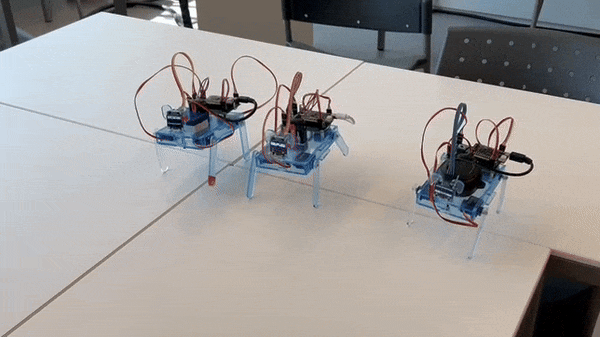
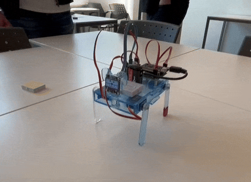
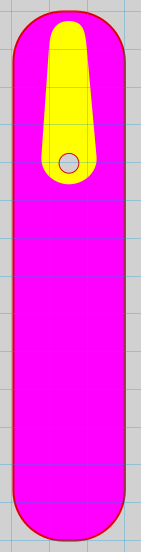
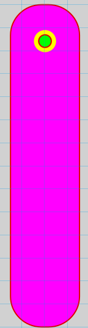
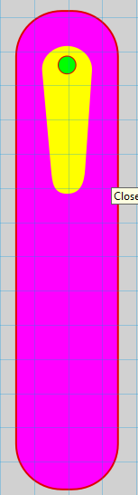

# Conclude & reflect

## Demonstration

These are 3 of our robot walking forward:

Not all of them are perfect, but here is the best one:

The face is flickering in the video, but this is just a camera artifact. In real life it looks fine.

## Requirements

These are all our requirements, per requirement is described if it's met or not. The requirements with the *won't* priority are left out.

 
Info 
<a href="../../home/requirements/">Click here</a>
for the full list of requirements, along with the date and who added them..

## Functional requirements
| REQ number | Description | MoSCoW | Met? | explanation |
|---|---|---|---|---|
| REQ001 | The robot must have a **wow** factor | Must | yes | According to our research, the requirements in the next row impact the wow-factor and our robot has those. |
| | The robot needs to have moving parts and should be able to do precise movements. | | | |
| REQ003 | The robot must be easy to assemble for prospective students | Must | Yes | We tested with a few teammates and we have also created a user manual to guide users through the process. |
| REQ004 | The price per robot must be as low as possible (maximum €20) | Must | No | We tried to keep the price as low as possible, but it is a bit higher than €20. |
| REQ005 | Webapp is a docker IMG that runs on a Raspberry Pi | Must | No | We have implemented a different method which can be found [here](../web/technical_documentation.md). |
| REQ006 | The robot must fit in the Smart city sub theme | Must | Yes | Our robot fits the smart home theme, because of the user interactability. |
| | (Smart mobility, Smart buildings, Public safety & security, Efficient government services, Waste management, Low-power sensors & Networks, Smart home networks, Smart supply chain and logistics management, Digital citizen, E-governance, Intelligent farming.)| | | |
| REQ009 | The webapp must be linked to a domain name that can be changed later (no hardcoding in PHP backend) | Must | No | Our web-app is not hosted anywhere, the IP-address has to be hardcoded. We have added a recommendation to the recommendations page. |
| REQ010 | There must be enough pins on the mcu to expand the amount of sensors at a later time. | Must | Yes | Our robot uses the ESP32 D0WDQ6 development board, which has enough pins left over for expansion. |
| REQ011 | The robot is able to be used as learning and teaching platform for other courses | Must | Yes | It has a few sensors and can be expanded later for different uses. |
| REQ012 | Security by design - The PHP web backend needs to be secure | Must | No | Not entirely, there is a command filter but not everything is secure. |
| REQ013 | The robot must be easy to dissamble for reuse on other open door days. | Must | Yes | A few team members have tried assembling and dissasembling, and it's not very difficult. We have also made an instruction manual for this. |
| REQ014 | The robots are selected on the webapp by scanning the QR codes printed on them | Must | No | We have decided to use a different method, not involving QR codes. |
| REQ015 | The webapp sends universal commands to the robots | Must | Yes | It sends keyword commands, for example: *forward, left, right, sit, lie*. |
| REQ016 | The robot translates the universal commands to functions | Must | Yes | The robot has a list of keyword, like the ones above that trigger certain functions. |
| REQ017 | The robot can be controlled with a virtual joystick on the webapp | Must | Yes | It's not really a joystick, but directional buttons that control the robot. |
| REQ018 | The robot can be given instructions through codeblocks on the webapp | Must | Yes | Using blockly, our website has code blocks that can be used to create a program that can control the robot. |
| REQ037 | The robot's legs do not collide whilst in operation | Must | Yes | The legs don't hit each other. However, they can hit the side of the body, where the top, bottom and side panels connect. |
| REQ038 | The robot's body is sturdy and does not break easily | Must | Yes | The body is made of 3mm acrylic. It is more than strong enough for our application. This might not be the case for some components however. |
| REQ040 | Microcontroller and components are connected through a proto-board | Must | Yes | On the robot is a protoboard. It has headers and pins for the ESP32 and other components. It also has a connector for a 9V battery. |
| REQ041 | The robot is powered by a 9V battery | Must | Yes | Connected to the protoboard is a 9V battery connector. The battery connects to a voltage regulator on the protoboard which then powers the ESP32 and the servos and other components. |

## Failures

(Describe at least 4 failures during the design and creation process. Per failure, describe:
o    what you wanted to achieve
o    what went wrong  
o    how you tried to solve it  
o    how you would approach the problem next time
ALSO ADD PHOTOS/VIDEOS)

### Failure 1
The power supply we initialy tried to use was not strong enough to power the servo's and esp at the same time. At first we wanted to use a few AA battery's to power the robot. We tried it with 2 AA battery's (3V) first but quickly realized this was far from enough. Then we tested it with 3 AA battery's, still not enough. And when 4 were tested, it was too much without any resistors. We then decided to use a 9V battery, which was clearly strong enough. But we needed to limit it somehow, so we orderd 9V voltage regulators not realizing it would be letting through 9V, we would be needing a 5V regulator. But since our power supply was 9V we just assumed we needed a matching 9V voltage regulator. After some trial and error we found out that we needed a different voltage regulator. We managed to find a 5V 2A voltage regulator online and used that in our final protoboard design. Next time we would first check the voltage of the power supply and then order the correct voltage regulator. And just start on powering the system earlier into the process. We waited untill quite late to start on the power supply and when the plan did not work out it brought on delay's.

### Failure 2

Servo's met benen - Luc

Our first idea was to make a design for legs to fit onto servo's with a servo arm attached. We had this idea, because we thought it would look cool and with the servo arm it would have extra grip.

this didn't really work out, because we coulnd't get the servo arm to tightly fit into the hole. So we where going to think of another design that could work better, so the servo would have a better gip on the legs.

We noticed that we could mount a screw into the servo gear so we changed to a design where we could mount the leg directly onto the servo gear and put a screw through the hole.

Here we also had some trouble, because the teeth of the servo gears are so small we can't cut it into the design. so this also wasn't really a good option to get a good fit onto the legs. it worked, but not perfectly and you had to be very precice to put the legs staight onto the servo.

So we went back to the first design but with a slight modification.

Here we have the servo arms back into the design, but we now have uses plasitc glue to glue the servo arms into the legs so we have a perfict fit with the easiest option to mount it. And if it still falls off we can still add the screw.

### Individual sessions
One of our failures in the communication section are private sessions, we now have it that every command is broadcasted to all the robots active. We would want it to have it selected by the connect web page. A solution would be to add a recipient value to the sent message, but this would need the api to be changed to recieve a JSON file format.

Another failure was the sent data, the only thing that is sent is a single string like "forward". We currently don't support more values being sent, like for how long the robot would walk, or to what robot you want to send it to. Sending a JSON object and processing that on the embedded side would resolve this failure.

### Web app
We are pretty happy with the way the web app turned out, allthough we could have started earlier with the blockly library instead of coding the draggable blocks by hand. This cost us a lot of time that could have been better spent. 

The web app turned out pretty well, and has lots of room for future projects and expandability.