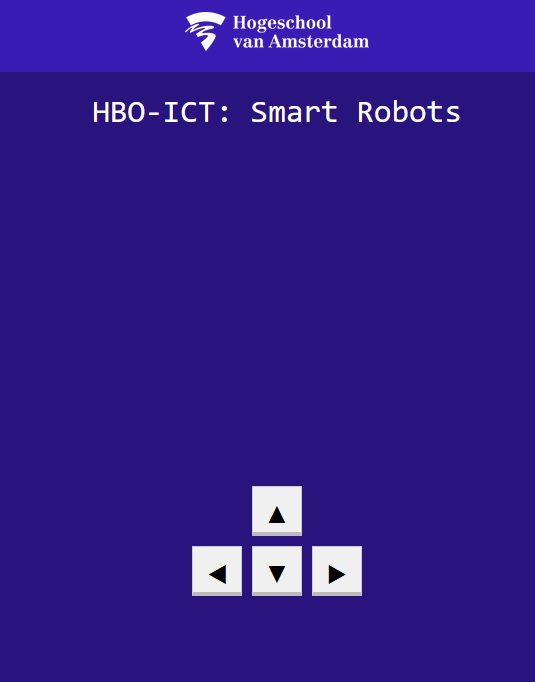
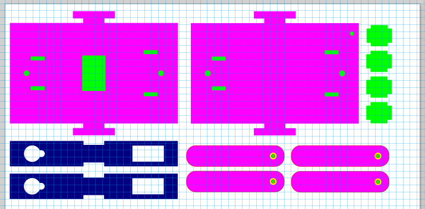
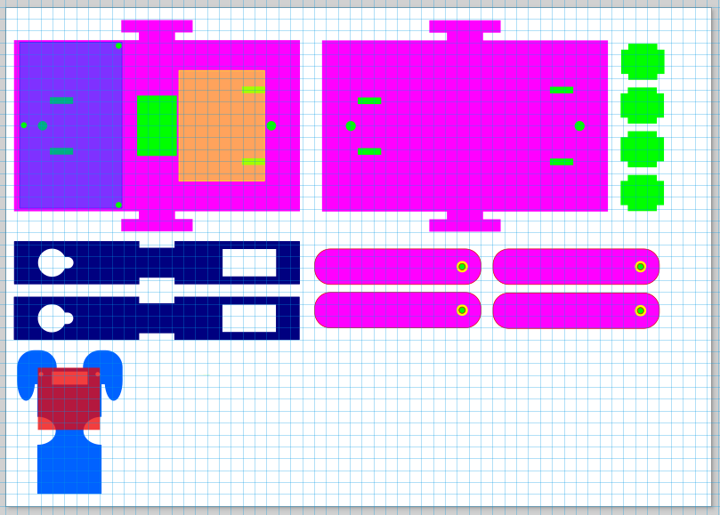
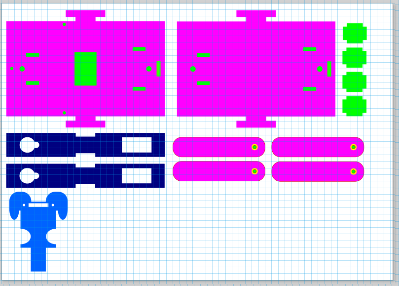

# Create & test

## Web Design
The first design of the web app was the most simple, it consisted of just the direct movement buttons, this looked like this:

We used this page to test the functionality of the api.
We uses html, which stands for Hypertext markup language. This is used for creating the structure to our website. Then we use CSS, which stands for Cascading Style Sheets. This is used for giving style and positioning to the elements defined in the HTML code. We dont use bootstrap or any other library for styling the CSS, just grid and flexbox.

All the functionality of the website is implemented by the javascript code, we can use javascript to add interactiveness and functions to the elements defined in the HTML code.

### The first dragging design
For our requirements, we needed code blocks that we could drag to program the robot, and have those commands be executed on the robot. Our first approach for draggable blocks was to program it by hand using javascipt, this looked like this
## Robot dog design

## Third iteration

### Metal to plastic servo's

We designed our previous robot to the measurements of the metal servo's. We changed to plasic servo's, because those are cheaper. But when we tried to put the plastic servo's in our robot we noticed that the servo stoppers didn't fit anymore in our baseplate. This was because the plastic servo's where a little bit bigger than the metal servo's so we needed to put the servo stoppers a little bit further back.

We also changed the sides of the robot to have square corners instead of rounded corners, this was more because we didn't like the corners of the bottom and top to be pointing out of the sides. So it was more of beauty choice instead of a functional one.

### Power supply

After some disucssion amongst the team, we decided to have 2 AA batteries in a battery pack on our robot, so we wanted to have a hole in the bottom, and a velcro strip on the batterypack and the bottom of the top layer. So we can put the batterypakc through the bottom and attach it to the velcro strip on the top plate. So the batteries are housed mostly inside the body of the robot dog.

### KERF

With the previous designs we cut out, we noticed that when manually having to add the KERF of the machine. The designs never perfectly fit onto each other, they where either too lose or too tight. So we decided to have the KERF already implemented in the desin so that you can put the design in the laser cutter and immediatly start cutting. 

This worked way better then the previous designs, appart from a couple of small errors in our measurements of the servo's. It went perfect.

In this iteration we made the design with the KERF of the lasercutter in mind. So all the parts and hole are precisely made so that you can just put the design in the machine and cut straight away.

This is our new design. Here we implemented all the discussed issues we had. So if everything went well, now we don't have to do anything anymore for the file and we can put it straight into the machine.

#### Important note
Do remember that we made this file to the measurements of the lasercutters in the HVA building. That laser has a thickness of 0.4 mm with the KERF of 0.2mm.   

## Fourth iteration

After some further consideration and testing we decided to use a 9V battery instead of the earlier proposed 2 AA batteries. The 2 AA batteries only provided 3V, which was not enough to power the servo's and board simulataneously. The 9V battery however, provided enough power to power the servo's and board. A bit too much even. We redesigned the way the battery will be held. instead of an opening in the bottom plate, we now have a perfectly sized opening in the top plate. The battery will be held in place stuck in the top plate and resting on the bottom plate. This way the battery is easily accessible and can be replaced quickly.

## Fifth iteration

In the fifth iteration we started on a face mount for the robot dog. A newly added requirement was for the robot dog to have a face so it would be a bit more interactive. We also added some more holes for screws to hold the protoboard in place with. The semi transparent fields you see are to measure out the protoboard(Purplish blue), the breadboard (yellow) and the OLED (red). The protoboard is mounted on 3 risers on the back of the robot. Whilst the breadboard is mounted on the front. The OLED will be mounted on the face with 2 screws. In this design there is nowhere to connect the facemount to the rest of the robot. But there's still a few design choices we would like to mull over and/or test out before we make the final design.

## Sixth iteration

In testing the fifth iteration we found that the rounded holes for the servo's no longer fitted them. Somewhere along the way it had gotten smaller or something in other settings had changed. This has been corrected. We also found the screw holes in the face mount to be just a bit too far apart from each other, this as well has been corrected in this sixth and hopefully final design.

We also added a slot in the top & bottom plate for the face mount to be connected to the rest of the robot. 