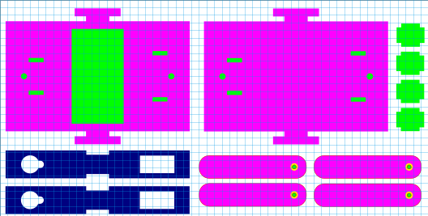

# Create & test

## Robot dog design

We designed our previous robot to the measurements of the metal servo's. We changed to plasic servo's, because those are cheaper. But when we tried to put the plastic servo's in our robot we noticed that the servo stoppers didn't fit anymore in our baseplate. This was because the plasic servo's where a little bit bigger then the metal servo's so we needed to put the servo stoppers a little bit more further back.

We also changed the sides of the robot to have squire corners instead of rounded corners, this was more because we didn't like the corners of the bottom and top to be pointing out of the sides. So it was more of beauty choise instead of a functional one.

After some negonegotiation, we decided to have 2 AA batteries in a battery pak on our robot, so we wanted to have a hole in the bottom, and a velcro strip on the batterypak and the bottom of the top layer. So we can put the batterypak through the bottom and attach it to the velcro strip.

With the previous designs we cut out, we noticed that when manually having to add the KERF of the machine. The designs never perfectly fit onto eachother, they where eighter too lose or too tight. So we decided to have the KERF already implemented in the desin so that you can put the design in the laser cutter and immediatly start cutting. 

This worked way better then the previous designs, appart from a couple of small errors in our measurements of the servo's. It went perfect.

In this iteration we made the design with the KERF of the lasercutter in mind. So all the parts and hole are precisely made so that you can just put the design in the machine and cut straight away.

This is our new design.
