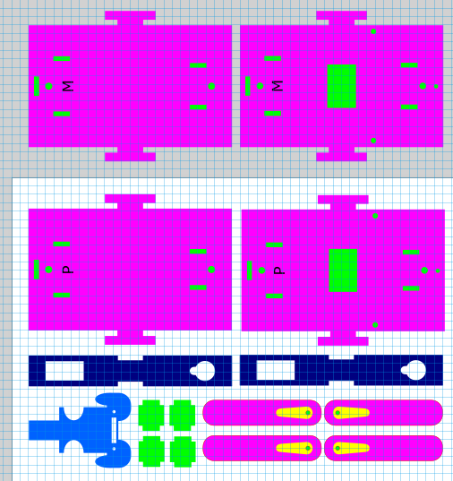
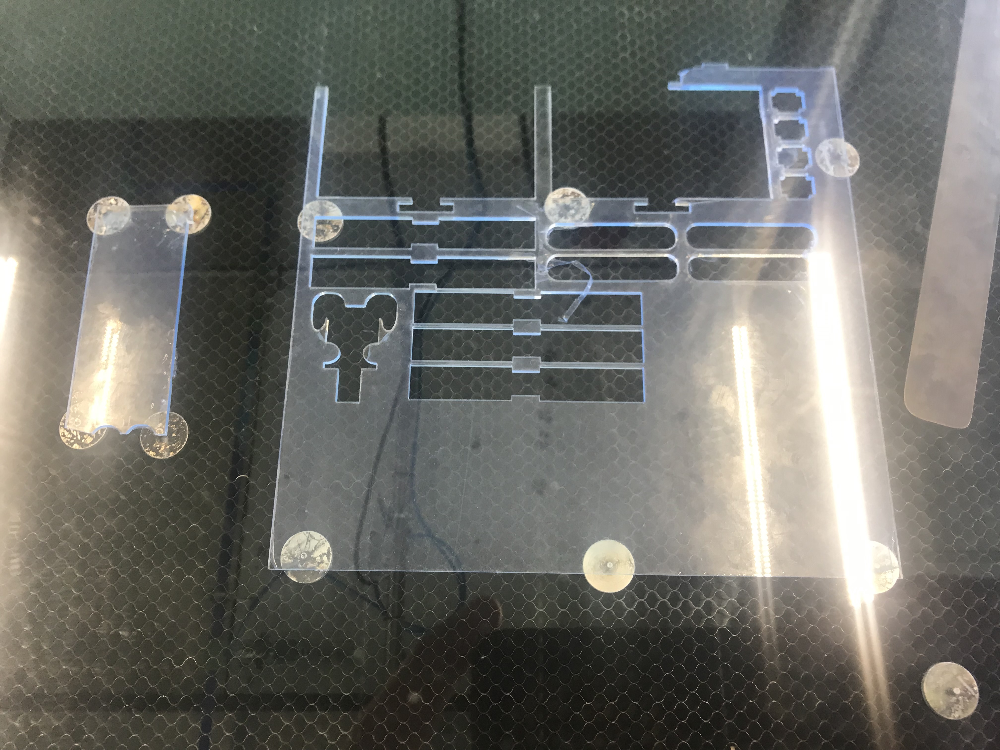
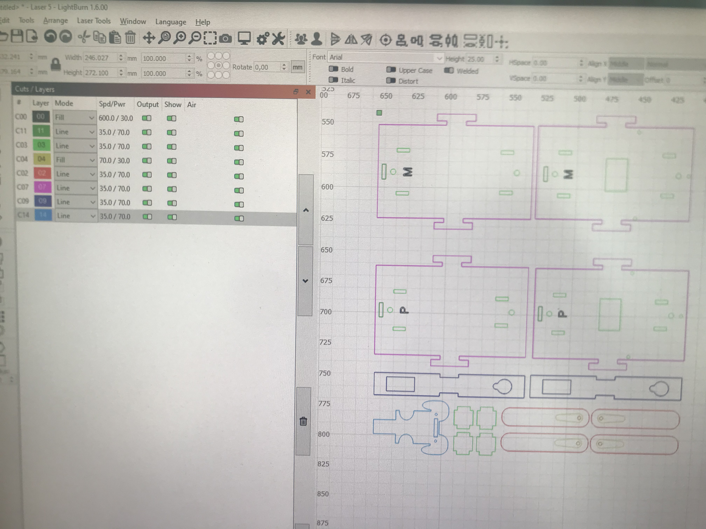
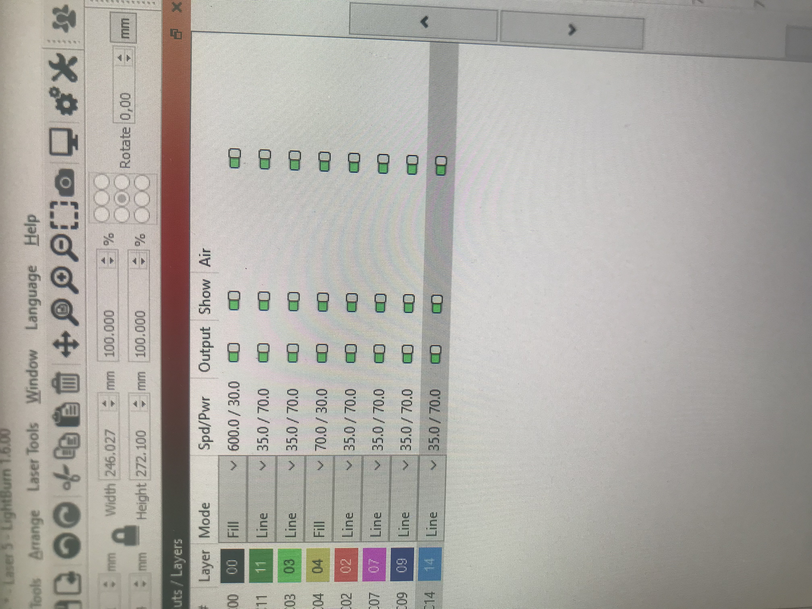
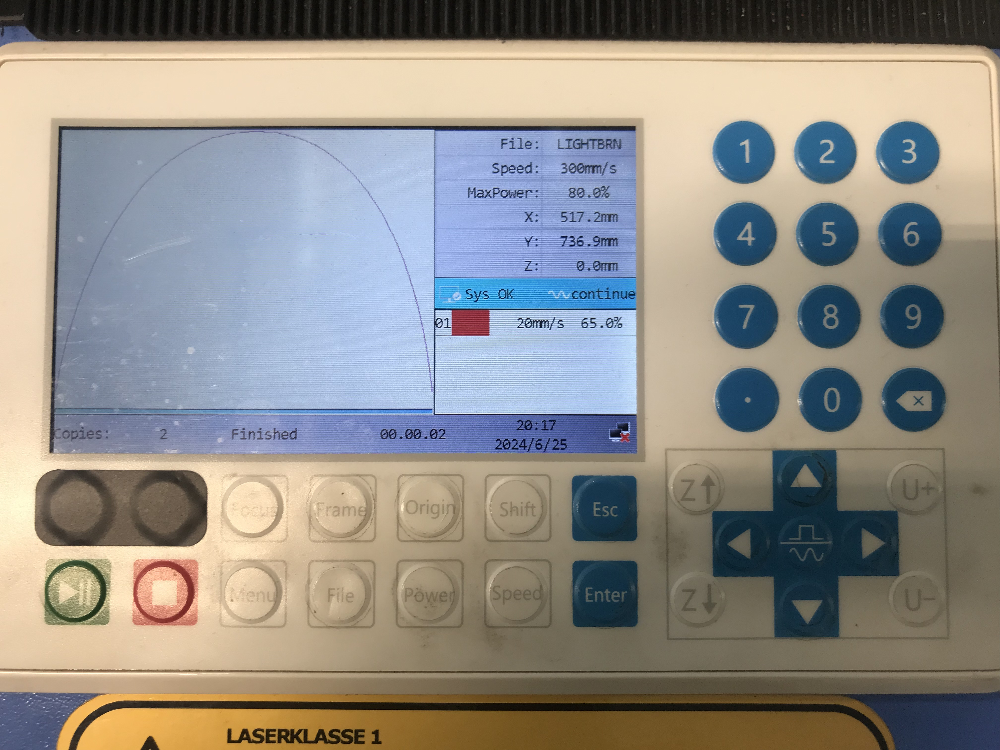

# Manufacturing 

Here we are going to talk about how to use our designs, and how we cut out our designs step by step. Or design is made in **inkscape**, we use the **lasercutters** provided by the **HVA Makerslab**. The software we use for the lasercutters ais the **lightburn software**.

## The design

Here you can see all the parts that need to be curt out to make one of our robots. Here you can see 2 defferent "baseplates" for the dog. In the proces of making our robots we have used 2 different types of servo's, one had a plastic cog, and the otherone had a metal cog. These servo's where a little bit different in their size so we have made 2 types of baseplates for the defferent servo's. 

The M stands for the metal servo's. And the P for plastic servo's. Chose which one you want to use. 

Below you have a link to redirect you to the SVG design.

 
Info 
<a href="../../design/Robot Dog/snoop_KERF_2.2.svg">Click here</a>,
to see the robot dog SVG design file.

## How to make a robot dog

To make our robot's we use a 3mm thick Acryllic plate. If you want to follow this guide, you need to also have this material. Because the power and speed of the lasercutter will differ for each material.

### Design in the software

1. you first need to put you acryllic plate into the machine, like this:

We use the metal bits to increase the hight of the plate so it doesn't touch the bottom. We do this so when the laser goes over the metal grid the licht doesn't get refected into your material, which gives you a better looking cut.

2. Then download our design.
3. choose which type of servo you want to use and select the corresponding baseplates.
4. Export the design onto an USB.
5. put the USB into the computer connected to the lasercutter and import it into the Lightburn software.

Now you should have something like this:

Here we still have both baseplates (for the metal servo's and the plastic ones), but you should chose one and remove the other. Also rearrange the pieces to not lose any unnecessary material.

6. Now you need to arrange the order in which the machine will cut and the speed and power of the cuts. 

To cut in the most optimal way you should copy the order like in the picture, also copy the Spd/Pwr settings, you can change this by double clicking on the "Layer" you want to change.

7. After you copied everything, you can send the file to the machine by clicking the "send" button on the right hand side of the software. Keep the file name "LIGHTBRN" and click "OKE"

The file will now be sent to the laser. 

### Positioning the laser

1. First you click the file button to go to all the availible files. Then in the top you should see the "LIGHTBRN" file, press the "Enter" button to select the file. With the arrows in the right hand corner you can move the laser.  

2. the laser has a very specific distance where the laser will cut the most optimal. To get this optimal distance, position your laser above your material (Preffered more in the middle of your material). Then press the "Focus" button, and the machine will automatically change the distance for optimal cutting. 

3. Now move the laser to the top left corner of your material. Leave some edge for error. 

4. When you like the positioning of the laser, you can press the "Origin" button to set the starting point of the laser. To see what area the laser will cut in, you can press the "Frame" button. This is recommended, so you can see if the laser will stay within the material.

5. If you like the position of your laser, you can press the green "start" button, so the laser will start to cut your design into you material.

6. Lastly connect all the embedded components you want, and enjoy your new robot!

Here a video of the process (this is from an old design):

<video width="320" height="240" controls>
  <source src="images/Manufactoring/laserut_process.mp4" type="video/mp4">
</video>

