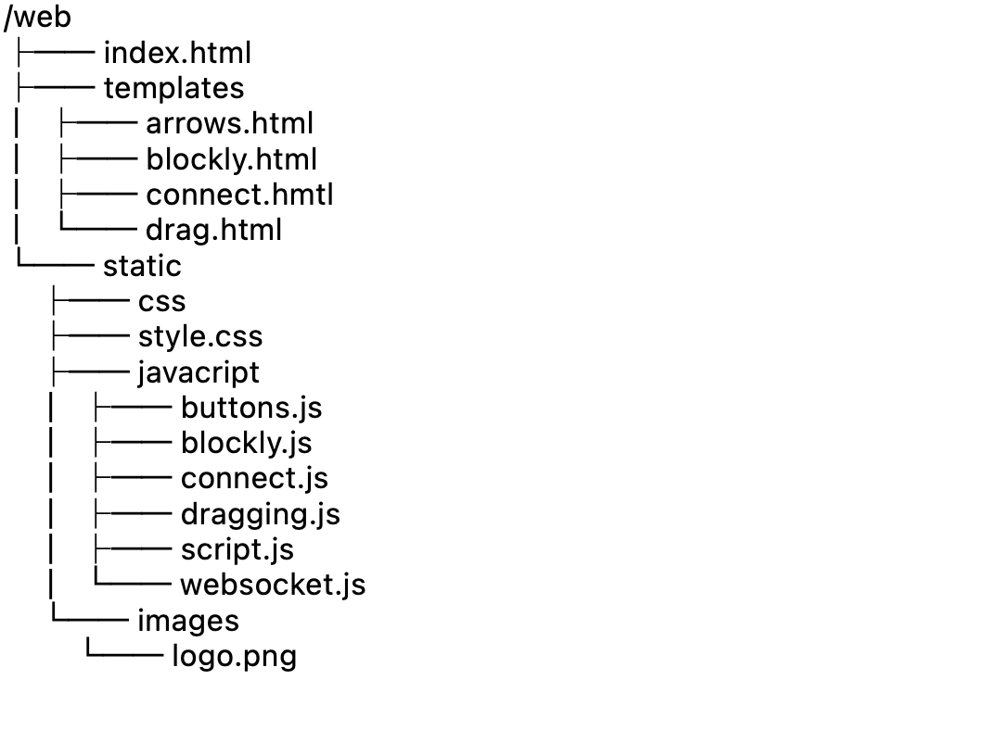
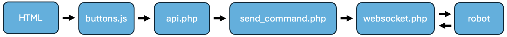
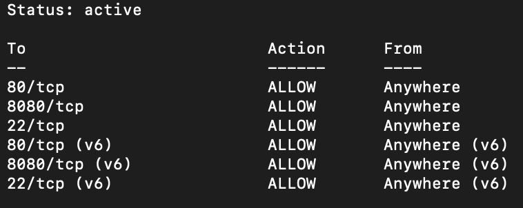
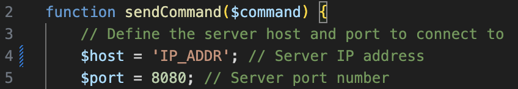
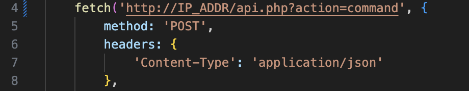

# Technical Documentation

## Technologies
### Front-end
#### HTML
For the frontend of the website, we used HTML. HyperText Markup Language (HTML) is the standard markup language for creating web pages. It provides the structure and content of a webpage by defining various elements such as headings, paragraphs, links, images, and more. Essentially, HTML enables the browser to interpret and display the content of a webpage correctly, ensuring that it appears as intended to users.

#### CSS
For styling and formatting the HTML page, We used CSS (Cascading Style Sheets). CSS allows us to control the layout, colors, fonts, and overall visual presentation of the webpage. By separating the content (HTML) from its presentation (CSS), We can create visually appealing and responsive designs that enhance the user experience.

#### Javascript
We used JavaScript to enhance interactivity on the website. JavaScript is a powerful scripting language commonly used in web development to add dynamic behavior to web pages.

We employed JavaScript for several purposes, including communicating with the API, enabling dynamic data fetching and display, and creating engaging visual effects, such as moving buttons when pressed. This enhances the overall user experience and makes the website more interactive.

### Back-end
#### PHP
For the backend, we used PHP. PHP, which stands for Hypertext Preprocessor, is a server-side scripting language widely used for web development. It is particularly well-suited for creating dynamic web pages and can perform various tasks such as processing form data, generating dynamic page content, managing sessions, and handling file uploads.

We utilized PHP to establish a REST API, facilitating communication between the frontend, websocket, and the robot. By implementing this RESTful interface, we enable seamless data exchange and interaction across different components, ensuring efficient and flexible functionality.

## Structure
### Front-end
The front-end consists of the 'index.html' file, a 'templates' folder, and a 'static' folder. In the 'templates' folder, you will find the various HTML pages used for the website. Inside the 'static' folder, there are three subfolders: 'css', 'images', and 'javascript'. The 'css' folder contains the 'style.css' file, which is responsible for the styling of the HTML files. The 'images' folder contains the 'logo.png' image, used for displaying the HvA logo. Lastly, the 'javascript' folder contains six JavaScript files: 'buttons.js' for communication with the API, 'blocky.js', 'connect.js', 'draggin.js', 'script.js', and 'websocket.js'.

Structuring the front-end in this manner ensures efficient organization and enhances development. By segregating files into dedicated folders such as 'css', 'images', and 'javascript', it promotes clarity and ease of access. This approach allows for seamless scalability, making it straightforward to add or modify resources as needed without cluttering the root directory. Additionally, this structure optimizes performance by facilitating efficient browser caching of static assets, resulting in faster loading times for users. Overall, this directory arrangement fosters maintainability, scalability, and efficiency in front-end development.




### Back-end
The back-end consists of three files: 'websocket.php', 'send_command.php', and 'api.php'. The 'websocket.php' file handles incoming connections from the robots and manages communication between the robot and the API. The 'api.php' file processes POST requests from the front-end, after which the 'send_command.php' file is used to send the command to the robot via the websocket.

## Communication
The communication consists of multiple components. Below, it is schematically depicted: 



Firstly, the robot must be connected to the WebSocket. This is automatically done when the robot is turned on. Once this is established, a button on the HTML page can be pressed. When this button is clicked, a JavaScript file named "buttons.js" is invoked. This script facilitates sending a POST request to the API with the specified task given by clicking the button.

This POST request is received by the API. The API checks the task and calls the "send_command.php" file to transmit the task to the robot via the "websocket.php" file.

## Setup webserver
To set up the web server, we used a server with Ubuntu 20.04. On the server, we want to open ports 22, 80, and 8080. Port 22 is used for SSH, port 80 for HTTP, and port 8080 for WebSocket. This can be done as follows:

1. Enable UFW:
```txt
sudo ufw enable
```

2. Open ports 80 (HTTP), 8080, and 22 (SSH):
```txt
sudo ufw allow 80/tcp
sudo ufw allow 8080/tcp
sudo ufw allow 22/tcp
```

3. Check the UFW rules to verify that the ports are open:
```txt
sudo ufw status
```


4. If successful, Docker can be installed. Follow [this](https://www.digitalocean.com/community/tutorials/how-to-install-and-use-docker-on-ubuntu-20-04) tutorial for installing Docker on Ubuntu. Only step 1 is required. 

5. Once Docker is installed on the server, the project can be cloned from GitLab. This can be done with:
```txt
sudo git clone https://gitlab.fdmci.hva.nl/IoT/2023-2024-semester-2/group-project/faaxeeheeqee80.git
```

6. Log in with your Git account.

7. After the project is cloned, navigate to the correct directory with:
```txt
cd faaxeeheeqee80
```

8. Build a Docker image tagged "little-endian" using the following command:
```txt
sudo docker build --tag little-endian .
```

9. Start a Docker container with the "little-endian" image, linking port 80 of the host to port 80 in the container, and port 8080 of the host to port 8080 in the container, by executing the following command:
```txt
sudo docker run --publish 80:80 --publish 8080:8080 --detach little-endian
```

After this, the web server is successfully set up. However, there are still a few places where the IP address of the host needs to be specified for proper communication.

Firstly, the send_command.php file in the /var/www/html folder needs to be edited. On line 4 of this file, the IP address of the host must be specified.



Additionally, in the folder /var/www/html/static/javascript, in the file buttons.js, the IP address of the host needs to be provided on line 4. With these steps completed, the web server is fully set up and operational.


